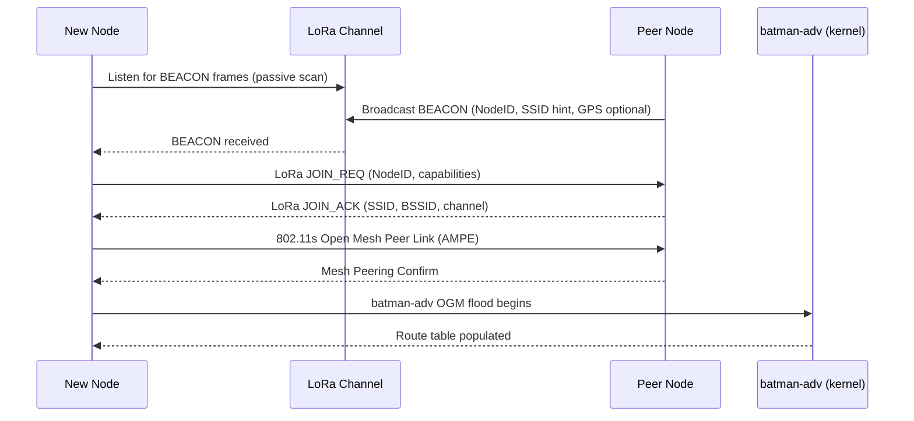

# LoRa-Assisted Mesh Networking Platform — Technical Design Document

> **Status:** Draft v0.1  
> **Date:** 2026-05-12  
> **Repository:** opd-ai/conspiracy  
> **Language:** Go (≥ 1.22)

---

## Table of Contents

1. [Executive Summary](#1-executive-summary)
2. [System Architecture](#2-system-architecture)
3. [LoRa Control Protocol](#3-lora-control-protocol)
4. [Auto-Join Mechanism](#4-auto-join-mechanism)
5. [Go Implementation Plan](#5-go-implementation-plan)
6. [Layer-3 Extensibility](#6-layer-3-extensibility)
7. [Deployment Model](#7-deployment-model)
8. [Risks & Open Questions](#8-risks--open-questions)
9. [License & Compliance Notes](#9-license--compliance-notes)

---

## 1. Executive Summary

This document specifies a **zero-configuration, community-owned layer-2 mesh network** built on IEEE 802.11r/s Wi-Fi and the B.A.T.M.A.N.-adv (`batman-adv`) kernel module, with LoRa (sub-GHz) as a dedicated out-of-band control channel. The platform is implemented in Go, targeting OpenWrt routers and Linux single-board computers equipped with LoRa radio hats (SX127x/SX126x chipsets).

Any in-range device running the daemon joins the mesh automatically: it listens for LoRa beacons, associates with the strongest peer, and enrolls into the `batman-adv` layer-2 fabric. The LoRa link carries only compact routing hints, neighbor summaries, and device-discovery beacons — never bulk payload — keeping duty-cycle well within regional limits. A clean `HintProvider`/`HintConsumer` interface allows future layer-3 overlays (cjdns, Yggdrasil, or custom protocols) to consume the same hint stream without modifying the core daemon. The design favors existing, permissively-licensed Go libraries, avoids libp2p and web frameworks, and is structured to scale across large geographic deployments with many nodes.

---

## 2. System Architecture

### 2.1 Component Overview

```
┌─────────────────────────────────────────────────────────────────────┐
│                          Mesh Node Daemon                           │
│                                                                     │
│  ┌──────────────┐    ┌──────────────┐    ┌──────────────────────┐  │
│  │  LoRa Radio  │    │  Wi-Fi Radio │    │   batman-adv (kernel │  │
│  │  (SX127x/    │    │  (802.11r/s) │    │   module bat0)       │  │
│  │   SX126x)    │    │              │    │                      │  │
│  └──────┬───────┘    └──────┬───────┘    └──────────┬───────────┘  │
│         │                   │                       │              │
│  ┌──────▼───────────────────▼───────────────────────▼───────────┐  │
│  │                     Core Daemon (Go)                         │  │
│  │                                                              │  │
│  │  ┌────────────┐  ┌────────────┐  ┌────────────────────────┐ │  │
│  │  │LoRa Driver │  │ nl80211    │  │  batman-adv Controller │ │  │
│  │  │ (loradrv)  │  │ Controller │  │  (batctl / netlink)    │ │  │
│  │  └─────┬──────┘  └─────┬──────┘  └───────────┬────────────┘ │  │
│  │        │               │                     │              │  │
│  │  ┌─────▼───────────────▼─────────────────────▼────────────┐ │  │
│  │  │              Hint Bus (in-process pub/sub)              │ │  │
│  │  └─────────────────────────┬──────────────────────────────┘ │  │
│  │                            │                                │  │
│  │  ┌─────────────────────────▼──────────────────────────────┐ │  │
│  │  │   HintConsumer plugins (cjdns, Yggdrasil, future L3)   │ │  │
│  │  └────────────────────────────────────────────────────────┘ │  │
│  └──────────────────────────────────────────────────────────────┘  │
└─────────────────────────────────────────────────────────────────────┘
```

### 2.2 Mermaid Sequence — Node Join Flow



### 2.3 Data Plane vs. Control Plane Separation

| Dimension | Data Plane | Control Plane |
|---|---|---|
| **Technology** | IEEE 802.11s + batman-adv `bat0` | Raw LoRa (sub-GHz, SX127x/SX126x) |
| **Bandwidth** | Typical 54–300 Mbps (Wi-Fi) | 250 bps – 50 kbps (LoRa SF7–SF12) |
| **Latency** | < 10 ms hop | 100 ms – 2 s per frame |
| **Range** | 50 – 200 m (urban) | 1 – 15 km (open), 0.5 – 3 km (urban) |
| **Payload** | Arbitrary Ethernet frames | ≤ 222 bytes (LoRa practical max) |
| **Role** | User traffic forwarding | Routing hints, beacons, discovery |
| **Protocol** | batman-adv OGM/OGMv2 | Custom hint frames (§3) |
| **Failure mode** | Degrades gracefully | Mesh continues; hints stale |

The LoRa channel is **advisory only**: if it is unavailable, the batman-adv data plane continues to operate using its own OGM protocol. LoRa hints accelerate convergence and assist discovery across range gaps where Wi-Fi cannot reach.

---

## 3. LoRa Control Protocol

### 3.1 Frame Types

| Type ID | Name | Description |
|---------|------|-------------|
| `0x01` | `BEACON` | Periodic node advertisement |
| `0x02` | `JOIN_REQ` | New node requests mesh credentials |
| `0x03` | `JOIN_ACK` | Peer delivers Wi-Fi association parameters |
| `0x04` | `ROUTE_HINT` | Compact neighbor/route summary |
| `0x05` | `REVOKE` | Node departure / route withdrawal |
| `0x06` | `PING` | Liveness check |
| `0x07` | `PONG` | Liveness response |

### 3.2 Common Frame Header (8 bytes)

```
 0                   1                   2                   3
 0 1 2 3 4 5 6 7 8 9 0 1 2 3 4 5 6 7 8 9 0 1 2 3 4 5 6 7 8 9 0 1
+-+-+-+-+-+-+-+-+-+-+-+-+-+-+-+-+-+-+-+-+-+-+-+-+-+-+-+-+-+-+-+-+
|  Version(4)  |   Type (8)    |            Seq (16)            |
+-+-+-+-+-+-+-+-+-+-+-+-+-+-+-+-+-+-+-+-+-+-+-+-+-+-+-+-+-+-+-+-+
|                         NodeID (32)                           |
+-+-+-+-+-+-+-+-+-+-+-+-+-+-+-+-+-+-+-+-+-+-+-+-+-+-+-+-+-+-+-+-+
```

- **Version** (4 bits): Protocol version; current = `0x1`
- **Type** (8 bits): Frame type from table above
- **Seq** (16 bits): Rolling sequence number for deduplication
- **NodeID** (32 bits): FNV-1a-32 hash of device MAC address (not secret; collision probability acceptable at community scale)

Total header: 8 bytes, leaving ≥ 214 bytes for payload.

### 3.3 BEACON Frame Payload (variable, ≤ 40 bytes typical)

```
+-+-+-+-+-+-+-+-+-+-+-+-+-+-+-+-+-+-+-+-+-+-+-+-+-+-+-+-+-+-+-+-+
|  Capabilities (8)  |  Channel (8)  |     RSSI Avg (8 signed) |
+-+-+-+-+-+-+-+-+-+-+-+-+-+-+-+-+-+-+-+-+-+-+-+-+-+-+-+-+-+-+-+-+
|              SSID Length (8)   |   SSID (≤32 bytes)          |
+-+-+-+-+-+-+-+-+-+-+-+-+-+-+-+-+-+-+-+-+-+-+-+-+-+-+-+-+-+-+-+-+
|  Lat (32-bit fixed-point, 1e-5 deg resolution, optional)      |
+-+-+-+-+-+-+-+-+-+-+-+-+-+-+-+-+-+-+-+-+-+-+-+-+-+-+-+-+-+-+-+-+
|  Lon (32-bit fixed-point, optional)                           |
+-+-+-+-+-+-+-+-+-+-+-+-+-+-+-+-+-+-+-+-+-+-+-+-+-+-+-+-+-+-+-+-+
|   HMAC-truncated (32 bits, see §3.5)                          |
+-+-+-+-+-+-+-+-+-+-+-+-+-+-+-+-+-+-+-+-+-+-+-+-+-+-+-+-+-+-+-+-+
```

**Capabilities byte:**

| Bit | Meaning |
|-----|---------|
| 7 | Has GPS |
| 6 | 802.11r capable |
| 5 | 802.11s capable |
| 4 | batman-adv enrolled |
| 3–0 | Reserved |

### 3.4 ROUTE_HINT Frame Payload (≤ 100 bytes)

Each ROUTE_HINT encodes up to **6 neighbor entries** (≈ 16 bytes each):

```
+-+-+-+-+-+-+-+-+-+-+-+-+-+-+-+-+-+-+-+-+-+-+-+-+-+-+-+-+-+-+-+-+
|  Neighbor Count (8)  |  Flags (8)  |  TTL (8)   | Pad (8)   |
+-+-+-+-+-+-+-+-+-+-+-+-+-+-+-+-+-+-+-+-+-+-+-+-+-+-+-+-+-+-+-+-+
| [Neighbor NodeID (32)] [RSSI (8, signed)] [Hops (8)] [Pad16] |
|  ... repeated Neighbor Count times ...                        |
+-+-+-+-+-+-+-+-+-+-+-+-+-+-+-+-+-+-+-+-+-+-+-+-+-+-+-+-+-+-+-+-+
|   HMAC-truncated (32 bits)                                    |
+-+-+-+-+-+-+-+-+-+-+-+-+-+-+-+-+-+-+-+-+-+-+-+-+-+-+-+-+-+-+-+-+
```

### 3.5 Duty-Cycle and Collision Avoidance

**Regulatory limits (EU 868 MHz, Sub-Band 1):** 1% duty cycle → maximum 36 seconds on-air per hour at SF12/BW125 (time-on-air ≈ 1 s for 50-byte frame).

| Frame Type | TX Interval | Notes |
|------------|-------------|-------|
| BEACON | 30 – 120 s (jittered ±20%) | Reduces collision probability |
| ROUTE_HINT | On topology change, max 1/60 s | Debounced 5 s |
| JOIN_REQ/ACK | On demand, ≤ 3 retries | Exponential back-off: 1 s, 2 s, 4 s |
| PING/PONG | Only if Wi-Fi link not available | Last-resort |

**Collision avoidance strategy:** Listen-Before-Talk (LBT) with carrier-sense using RSSI threshold (−90 dBm). A node picks a random back-off slot (0–127 ms) before transmitting. Receiving side deduplicates by `(NodeID, Seq)` pairs in a 64-entry LRU cache, TTL 60 s. This is **raw LoRa** (not LoRaWAN Class A), avoiding gateway infrastructure dependency.

### 3.6 Security and Authentication Model

**Threat model:** The LoRa channel is assumed **not confidential** (broadcast, low-power, easily received by anyone in range). The goal is **integrity** (prevent spoofed routing hints that could redirect traffic) and **replay prevention**.

**Mechanism:**

1. **Shared mesh key** (`MESH_KEY`, 256-bit): provisioned out-of-band (QR code, NFC tap, or manual entry). This is the same key used for 802.11s AMPE.
2. **Per-frame HMAC-SHA256, truncated to 32 bits**: `HMAC-SHA256(MESH_KEY, header || payload)[0:4]`. A 32-bit truncated HMAC provides ~1-in-4 billion false-positive rate — sufficient given the low frame rate.
3. **Sequence number** (16-bit rolling): prevents replay within a 65536-frame window. Nodes discard frames with `Seq` ≤ last-seen from same `NodeID` (with wrap-around tolerance of 32768).
4. **No per-node public keys** in v1: adding a lightweight ECDH (Curve25519) session layer is deferred to v2 as an optional extension.

> **Note:** Sybil attacks cannot be fully prevented with a shared key. §4.3 discusses the "no questions asked" trust model and its limits.

---

## 4. Auto-Join Mechanism

### 4.1 Discovery Sequence

```
New Device                    LoRa Channel              Existing Peer
     │                              │                         │
     │──── LoRa passive listen ────▶│◀──── BEACON (every 30–120s) ────│
     │◀─── BEACON decoded ──────────│                         │
     │                              │                         │
     │─────────────── LoRa JOIN_REQ (NodeID, caps) ──────────▶│
     │◀──────────────── LoRa JOIN_ACK (SSID, BSSID, Ch, Key) ─│
     │                              │                         │
     │══════════ 802.11s Open Mesh Peering (AMPE) ════════════▶│
     │◀═══════════════ Peering Confirm ═══════════════════════│
     │                              │                         │
     │─── ip link set bat0 up ─────▶[kernel]                  │
     │─── batctl if add mesh0 ─────▶[kernel]                  │
     │◀─── batman-adv OGM flood begins ──────────────────────▶│
     │                              │                         │
     │   [Node is now a full mesh relay]                       │
```

**Step-by-step:**

1. **LoRa scan (0 – 120 s):** New node powers on, tunes LoRa to the configured frequency (default 868.1 MHz EU / 915 MHz US), and listens for `BEACON` frames. If none received within a configurable timeout (`beacon_timeout`, default 120 s), it broadcasts its own `BEACON` (acting as a new mesh seed).
2. **BEACON validation:** Validate truncated HMAC against `MESH_KEY`. Discard if invalid (wrong network).
3. **JOIN_REQ / JOIN_ACK:** New node sends `JOIN_REQ` to the peer with highest RSSI. Peer responds with `JOIN_ACK` containing Wi-Fi SSID, BSSID, channel, and mesh key confirmation.
4. **802.11s peering:** New node configures `wpa_supplicant` (or `hostapd` in mesh mode) with received parameters and initiates `AMPE` (Authenticated Mesh Peering Exchange) using `MESH_KEY` as the PMK seed.
5. **batman-adv enrollment:** Daemon calls `batctl if add <mesh_iface>` via netlink. The kernel module begins flooding OGM packets; routing table converges within seconds.
6. **Relay activation:** By default the node begins relaying immediately. No "admission" step; any node with a valid `MESH_KEY` is trusted.

### 4.2 IP Address Assignment

No DHCP server is required at the mesh layer (`bat0` is a layer-2 bridge). Upper-layer addressing can be:
- **Link-local IPv6 (SLAAC):** Default; zero configuration.
- **IPv4 APIPA (169.254.x.x):** Fallback for IPv4-only applications.
- **cjdns/Yggdrasil auto-addressing:** Injected by a HintConsumer plugin (§6).

### 4.3 Trust Model and Sybil Considerations

The "no questions asked" join model means **possession of `MESH_KEY` is the sole access credential**. Implications:

| Concern | Mitigation |
|---------|-----------|
| Rogue relay (traffic interception) | batman-adv is L2; encryption above L2 (e.g., Yggdrasil) mitigates. |
| Key leakage | Key rotation via new BEACON with `JOIN_ACK` carrying updated key (v2 feature). |
| Sybil flooding OGMs | batman-adv OGM rate-limits by design; `ROUTE_HINT` duty-cycle limits LoRa flood rate. |
| Denial of LoRa channel | LoRa is advisory; Wi-Fi mesh continues independently. |
| Physical node compromise | Out of scope for v1; TPM-backed key storage recommended for sensitive deployments. |

---

## 5. Go Implementation Plan

### 5.1 Recommended Libraries

```
Library: go-lora (tarm/serial + custom SX127x driver)
License: MIT
Import: github.com/tarm/serial
Why: Pure-Go serial/SPI abstraction for SX127x UART-mode boards; no CGo dependency.
```

```
Library: periph.io/x/periph
License: Apache-2.0
Import: periph.io/x/periph/conn/spi
Why: Idiomatic Go hardware abstraction for SPI bus access to SX127x/SX126x in SPI mode.
```

```
Library: github.com/brocaar/lorawan
License: MIT
Import: github.com/brocaar/lorawan
Why: LoRaWAN frame encoding primitives reused for compact binary frame marshaling without gateway dependency.
```

```
Library: github.com/vishvananda/netlink
License: Apache-2.0
Import: github.com/vishvananda/netlink
Why: Pure-Go netlink bindings for interface management, route table manipulation, and batman-adv IFLA_INFO_KIND control.
```

```
Library: github.com/mdlayher/netlink
License: MIT
Import: github.com/mdlayher/netlink
Why: Low-level netlink socket abstraction used by nl80211 and batman-adv sub-packages.
```

```
Library: github.com/mdlayher/wifi
License: MIT
Import: github.com/mdlayher/wifi
Why: nl80211-based Wi-Fi control (interface creation, BSS scan, mesh join) without shelling out to iw.
```

```
Library: github.com/pelletier/go-toml/v2
License: MIT
Import: github.com/pelletier/go-toml/v2
Why: TOML config file support; widely used in embedded Go projects; zero external dependencies.
```

```
Library: log/slog (stdlib)
License: BSD-3-Clause (Go stdlib)
Import: log/slog
Why: Structured logging in Go stdlib since 1.21; no additional dependency.
```

```
Library: golang.org/x/crypto
License: BSD-3-Clause
Import: golang.org/x/crypto/hkdf
Why: HKDF key derivation for per-session subkeys from MESH_KEY; well-audited Go extended library.
```

```
Library: github.com/prometheus/client_golang
License: Apache-2.0
Import: github.com/prometheus/client_golang/prometheus
Why: Exposes node metrics (peer count, OGM rate, LoRa RSSI) via net/http handler; no web framework needed.
```

### 5.2 Module and Package Layout

```
conspiracy/
├── cmd/
│   └── conspiracyd/        # daemon entry point
│       └── main.go
├── internal/
│   ├── lora/               # LoRa radio driver and frame codec
│   │   ├── driver.go       # SPI/serial abstraction (periph.io or tarm/serial)
│   │   ├── frame.go        # frame marshal/unmarshal
│   │   └── scheduler.go    # duty-cycle scheduler, LBT, jitter
│   ├── wifi/               # nl80211 / wpa_supplicant control
│   │   ├── mesh.go         # 802.11s mesh join/leave
│   │   └── scan.go         # BSS scan helpers
│   ├── batman/             # batman-adv netlink control
│   │   ├── controller.go   # batctl operations via netlink
│   │   └── ogm.go          # OGM event listener
│   ├── hint/               # HintBus, HintProvider, HintConsumer interfaces
│   │   ├── bus.go          # in-process pub/sub
│   │   └── types.go        # shared types (RoutingHint, Neighbor, etc.)
│   ├── autojoin/           # discovery state machine
│   │   └── join.go
│   ├── crypto/             # HMAC helpers, key management
│   │   └── auth.go
│   └── config/             # config file parsing
│       └── config.go
├── plugins/
│   ├── cjdns/              # HintConsumer for cjdns peering
│   │   └── consumer.go
│   └── yggdrasil/          # HintConsumer for Yggdrasil peering
│       └── consumer.go
├── go.mod
└── go.sum
```

### 5.3 Key Interface Definitions

All network addresses and connections use standard library interfaces.

```go
// internal/lora/driver.go

// PacketRadio is satisfied by any LoRa radio backend.
// It deliberately mirrors net.PacketConn so callers can substitute
// a UDP stub in tests without hardware.
type PacketRadio interface {
    ReadFrom(p []byte) (n int, addr net.Addr, err error)
    WriteTo(p []byte, addr net.Addr) (n int, err error)
    Close() error
    SetDeadline(t time.Time) error
}

// LoRaAddr implements net.Addr for a LoRa node identifier.
type LoRaAddr struct{ NodeID uint32 }

func (a LoRaAddr) Network() string { return "lora" }
func (a LoRaAddr) String() string  { return fmt.Sprintf("lora:%08x", a.NodeID) }
```

```go
// internal/hint/types.go

// RoutingHint carries a condensed neighbor summary from the LoRa channel.
type RoutingHint struct {
    Source    net.Addr
    Neighbors []Neighbor
    TTL       uint8
    Timestamp time.Time
}

type Neighbor struct {
    NodeID uint32
    RSSI   int8
    Hops   uint8
}
```

### 5.4 Concurrency Model

The daemon is structured around a set of long-running goroutines communicating via typed channels:

```
┌──────────────────┐      hints chan       ┌──────────────────┐
│  LoRa RX goroutine│ ─────────────────▶  │   Hint Bus       │
└──────────────────┘                       │  (fan-out)       │
                                           └────────┬─────────┘
┌──────────────────┐      hints chan              │ (broadcast)
│  batman-adv OGM  │ ─────────────────▶          │
│  listener        │                    ┌─────────▼──────────┐
└──────────────────┘                    │  HintConsumer(s)   │
                                        │  (cjdns, Yggdrasil)│
┌──────────────────┐    control chan     └────────────────────┘
│  Auto-join FSM   │ ◀──────────────── LoRa RX events
└──────────────────┘
```

**Shared state protection:**

| State | Protection |
|-------|-----------|
| Peer table (`map[uint32]PeerInfo`) | `sync.RWMutex`; reads are frequent, writes rare |
| Route table (batman-adv view) | `sync.Mutex`; refreshed by netlink listener |
| LoRa TX queue | `chan loraFrame` (buffered 16); single TX goroutine owns radio |
| LoRa dedup cache | `sync.Mutex` on LRU map (bounded 64 entries) |
| Config (read-only after init) | No lock needed; loaded once at start |

Worker goroutines are started with `context.Context` propagation; shutdown is cooperative via `context.Cancel()`.

---

## 6. Layer-3 Extensibility

### 6.1 HintProvider and HintConsumer Interfaces

```go
// internal/hint/bus.go

// HintProvider produces RoutingHints from any source (LoRa, batman-adv, etc.)
type HintProvider interface {
    // Subscribe returns a channel on which the provider sends hints.
    // Callers MUST drain or close the returned channel.
    Subscribe(ctx context.Context) (<-chan RoutingHint, error)
    Name() string
}

// HintConsumer reacts to RoutingHints to update a layer-3 overlay.
type HintConsumer interface {
    // Consume is called for each hint; implementations MUST be non-blocking
    // or run their own goroutine internally.
    Consume(ctx context.Context, hint RoutingHint) error
    Name() string
}

// Bus fans out hints from all registered providers to all consumers.
type Bus struct {
    providers []HintProvider
    consumers []HintConsumer
}

func (b *Bus) Register(p HintProvider) { b.providers = append(b.providers, p) }
func (b *Bus) Attach(c HintConsumer)   { b.consumers = append(b.consumers, c) }
func (b *Bus) Run(ctx context.Context) error { /* fan-out loop */ return nil }
```

### 6.2 Concrete Example — Yggdrasil Peer Injection

Yggdrasil accepts peer addresses via its admin socket (`/var/run/yggdrasil.sock`). When a ROUTE_HINT arrives carrying a neighbor's IPv6 hint (optional extension field), the consumer translates it:

```go
// plugins/yggdrasil/consumer.go

type YggdrasilConsumer struct {
    adminConn net.Conn // unix socket to yggdrasil admin API
}

func (y *YggdrasilConsumer) Consume(ctx context.Context, h hint.RoutingHint) error {
    for _, n := range h.Neighbors {
        if n.Hops > 2 {
            continue // only inject close neighbors
        }
        addr := deriveYggAddr(n.NodeID) // maps NodeID → Yggdrasil 200::/7 address
        return y.addPeer(ctx, addr)
    }
    return nil
}

func (y *YggdrasilConsumer) Name() string { return "yggdrasil" }
```

### 6.3 Concrete Example — cjdns Peer Injection

cjdns exposes a UDP admin API. The consumer calls `UDPInterface_beginConnection`:

```go
// plugins/cjdns/consumer.go

type CjdnsConsumer struct {
    adminAddr net.Addr // UDP address of cjdns admin interface
    adminConn net.PacketConn
    password  string
}

func (c *CjdnsConsumer) Consume(ctx context.Context, h hint.RoutingHint) error {
    for _, n := range h.Neighbors {
        pubKey := lookupCjdnsKey(n.NodeID) // from local key registry
        if pubKey == "" {
            continue
        }
        return c.beginConnection(ctx, pubKey, n.NodeID)
    }
    return nil
}

func (c *CjdnsConsumer) Name() string { return "cjdns" }
```

Both consumers register with the `hint.Bus` at startup and receive hints without any changes to the core daemon. A future overlay only needs to implement the two-method `HintConsumer` interface and call `bus.Attach(consumer)`.

---

## 7. Deployment Model

### 7.1 Target Hardware Profiles

| Profile | Example Hardware | Notes |
|---------|-----------------|-------|
| **OpenWrt router** | GL.iNet GL-AR750S + RAK831 LoRa HAT | Most common; OpenWrt provides 802.11s and batman-adv |
| **Linux SBC (ARM)** | Raspberry Pi 4 + RAK2245/SX1302 HAT | High-performance relay node; suitable for gateway role |
| **ARM SBC (minimal)** | NanoPi R2S + LoRa breakout (SX1276) | Low-cost node; single Wi-Fi radio |
| **RISC-V SBC** | Sipeed Lichee Pi 4A | Emerging platform; confirmed Linux 5.15+ batman-adv support |

**Minimum requirements:**
- Linux kernel ≥ 5.10 (batman-adv module, nl80211 generic netlink)
- Go cross-compilation target: `GOARCH=arm64`, `GOARCH=mipsle` (OpenWrt), `GOARCH=riscv64`
- LoRa hardware on SPI bus or UART (SX127x series) or USB serial (LoRa stick)

### 7.2 System Service

```toml
# /etc/conspiracyd/config.toml (example)
[lora]
device        = "/dev/spidev0.0"   # or "/dev/ttyS1" for UART
frequency_mhz = 868.1
spreading     = 10                  # SF10: ~980 bps, ~4 km range
bandwidth_khz = 125
mesh_key      = "hex:aabbcc..."     # 32-byte hex; MUST be changed

[wifi]
mesh_interface = "wlan0"
ssid           = "conspiracy-mesh"
channel        = 6

[batman]
interface      = "bat0"

[plugins]
yggdrasil = true
cjdns     = false
```

The daemon runs as a systemd unit:

```ini
[Unit]
Description=Conspiracy LoRa-Mesh Daemon
After=network.target

[Service]
ExecStart=/usr/sbin/conspiracyd -config /etc/conspiracyd/config.toml
Restart=on-failure
RestartSec=5s

[Install]
WantedBy=multi-user.target
```

### 7.3 OTA Updates

- **Signed images:** Build artifacts signed with `minisign` (Ed25519). Nodes verify signature before applying.
- **Dual-partition layout:** Standard A/B rootfs flip (OpenWrt sysupgrade compatible).
- **Update channel:** Updates are announced via LoRa `BEACON` extension field carrying a version string and a URL (reachable over the mesh once joined). The actual download happens over the Wi-Fi mesh using `net/http`.
- **Rollback:** Watchdog timer triggers reboot to previous partition if daemon fails to start within 60 s of update.

### 7.4 Bootstrapping a New Network

1. Generate a `MESH_KEY`: `openssl rand -hex 32`
2. Encode as QR code; distribute physically to founding nodes.
3. Flash and configure at least 2 nodes with the same key.
4. Power on — they will find each other via LoRa BEACON within 120 s.
5. Additional nodes join automatically once they have the key provisioned.

---

## 8. Risks & Open Questions

### 8.1 Risks

| Risk | Severity | Likelihood | Mitigation |
|------|----------|-----------|------------|
| Regulatory LoRa duty-cycle violation | High | Medium | Strict TX scheduler (§3.5); configurable per-region limits |
| batman-adv route oscillation in dense deployments | Medium | Medium | Tune OGM interval; use batman-adv v2 (B.A.T.M.A.N. V) for more stable metric |
| LoRa collision in high-density deployments (> 50 nodes in range) | Medium | High | Frequency hopping across 3 sub-bands; increase TX jitter window |
| Key management complexity (MESH_KEY distribution) | High | High | Invest in UX: QR provisioning, NFC tap; future v2 key rotation |
| batman-adv kernel module unavailable on target | Medium | Low | Provide fallback to `wpa_supplicant` mesh-only mode without B.A.T.M.A.N. |
| Go cross-compilation gap (CGo dependencies) | Low | Low | Only pure-Go or periph.io libraries selected (§5.1) |
| nl80211 kernel API changes | Low | Low | Depend on `mdlayher/wifi` which tracks upstream nl80211 |

### 8.2 Open Questions

1. **Sub-1 GHz frequency selection:** EU 868 MHz and US 915 MHz are covered; other regions (Asia 433/920 MHz, AU 915–928 MHz) need per-region config profiles.
2. **GPS integration depth:** BEACON optionally carries lat/lon (§3.3). Should the daemon integrate a GPS daemon (gpsd) for automatic position updates?
3. **Mesh key rotation ceremony:** How should a community rotate `MESH_KEY` without splitting the mesh? A two-phase commit protocol over LoRa is possible but complex.
4. **batman-adv vs. 802.11s mesh routing:** Some deployments may prefer 802.11s path selection (HWMP) without batman-adv. The daemon should support a `batman_adv = false` config option routing only via HWMP.
5. **IPv4 addressing:** APIPA (169.254.x.x) is unreliable across large meshes due to collision probability. Consider a deterministic scheme derived from `NodeID`.
6. **Security escalation path:** 32-bit truncated HMAC is sufficient for integrity but not authentication. If deployments grow, upgrade to full Ed25519 signatures on BEACON frames.
7. **Power management:** Battery-powered nodes need adaptive TX interval and CPU sleep. This is not designed for v1 but the hint bus architecture accommodates a `PowerManager` consumer.
8. **Multi-radio nodes:** Nodes with 2 Wi-Fi radios can dedicate one to 802.11s mesh and one to client AP. Interface selection logic needs specification.

---

## 9. License & Compliance Notes

All recommended dependencies use OSI-approved permissive licenses. The following table summarizes compliance obligations:

| Library | SPDX License | Obligations |
|---------|-------------|-------------|
| `github.com/tarm/serial` | MIT | Include copyright notice in binary distribution |
| `periph.io/x/periph` | Apache-2.0 | Include `NOTICE` file; patent grant applies |
| `github.com/brocaar/lorawan` | MIT | Include copyright notice |
| `github.com/vishvananda/netlink` | Apache-2.0 | Include `NOTICE` file |
| `github.com/mdlayher/netlink` | MIT | Include copyright notice |
| `github.com/mdlayher/wifi` | MIT | Include copyright notice |
| `github.com/pelletier/go-toml/v2` | MIT | Include copyright notice |
| `log/slog` (Go stdlib) | BSD-3-Clause | Include Go AUTHORS file |
| `golang.org/x/crypto` | BSD-3-Clause | Include Go AUTHORS file |
| `github.com/prometheus/client_golang` | Apache-2.0 | Include `NOTICE` file |

**Project license recommendation:** MIT or Apache-2.0. Apache-2.0 is recommended if patent protection for contributors is desired. Both licenses are compatible with all dependencies listed above.

**batman-adv kernel module:** Licensed GPLv2. The daemon communicates with it via netlink sockets (userspace ↔ kernel boundary), which does **not** create a GPL derivative work obligation for the Go daemon itself. This is consistent with the Linux kernel syscall exception.

**OpenWrt integration:** OpenWrt packages are distributed under their respective upstream licenses. The `conspiracy` daemon would be an independent package in the OpenWrt feed, requiring only its own `Makefile` and license file.

**No copyleft contamination:** No GPL/LGPL libraries are linked into the Go binary. All selected libraries are MIT, Apache-2.0, or BSD-3-Clause, ensuring the daemon binary may be distributed under a permissive license.

---

*End of document. For questions or contributions, open an issue in the `opd-ai/conspiracy` repository.*
