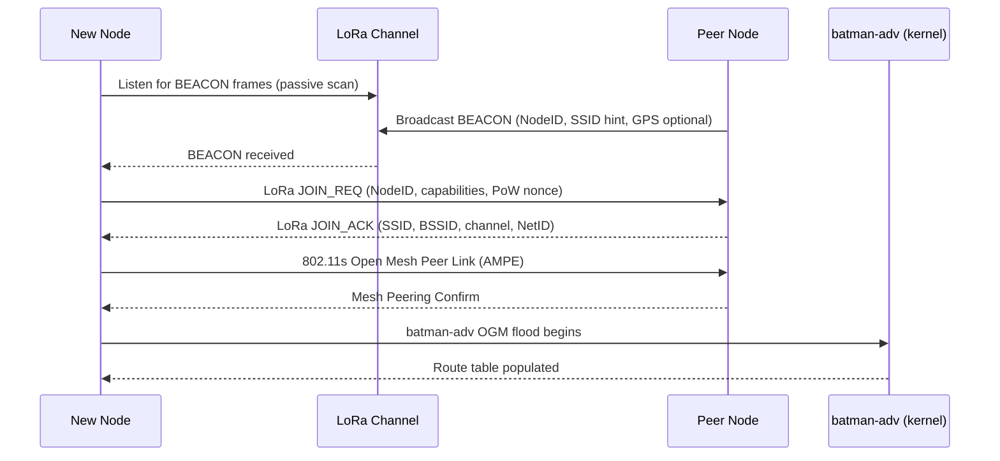

# LoRa-Assisted Mesh Networking Platform — Design Specification v1.0

## Document Control
- **Status**: Finalized Draft (pending architect review on flagged items)
- **Last Updated**: 2026-05-12
- **Base Version**: v0.3 Draft
- **Repository**: opd-ai/conspiracy
- **Language**: Go (≥ 1.22)
- **Changes from Previous Draft**: See Appendix A for complete consistency review

---

## Table of Contents

1. [Executive Summary](#1-executive-summary)
2. [System Architecture](#2-system-architecture)
3. [LoRa Control Protocol](#3-lora-control-protocol)
4. [Auto-Join Mechanism](#4-auto-join-mechanism)
5. [Go Implementation Plan](#5-go-implementation-plan)
6. [Layer-3 Extensibility](#6-layer-3-extensibility)
7. [Deployment Model](#7-deployment-model)
8. [Risks & Open Questions](#8-risks--open-questions)
9. [License & Compliance Notes](#9-license--compliance-notes)

**Appendices:**
- [Appendix A: Consistency Review Notes](#appendix-a-consistency-review-notes)
- [Appendix B: Completeness Gaps](#appendix-b-completeness-gaps)
- [Appendix C: Glossary](#appendix-c-glossary)

---

## 1. Executive Summary

This document specifies a **zero-configuration, community-owned layer-2 mesh network** built on IEEE 802.11r/s Wi-Fi and the B.A.T.M.A.N.-adv (`batman-adv`) kernel module, with LoRa (sub-GHz) as a dedicated out-of-band control channel. The platform is implemented in Go, targeting OpenWrt routers and Linux single-board computers equipped with LoRa radio modules via SPI, UART, or USB interfaces (SX127x/SX126x chipsets, USB-Serial LoRa devices).

Any in-range device running the daemon joins the mesh automatically: it listens for LoRa beacons, associates with the strongest peer, and enrolls into the `batman-adv` layer-2 fabric. The LoRa link carries only compact routing hints, neighbor summaries, and device-discovery beacons — never bulk payload — keeping duty-cycle well within regional limits. A clean `HintProvider`/`HintConsumer` interface allows future layer-3 overlays (cjdns, Yggdrasil, or custom protocols) to consume the same hint stream without modifying the core daemon. The design favors existing, permissively-licensed Go libraries, avoids libp2p and web frameworks, and is structured to scale across large geographic deployments with many nodes.

**Production-Readiness Enhancements:** This version implements critical security, scalability, and resilience improvements including: hybrid nonce construction with persistent reboot counter, entropy audit at startup, multi-frequency LoRa zoning for 250+ nodes per area, explicit 5,000-node architectural limits with federation guidance, partition rejoin OGM storm mitigation, reduced ROUTE_HINT TTL with probabilistic forwarding, NodeID collision detection, 96-bit HMAC truncation, REKEY replay prevention, tiered peer storage, netlink multicast route updates, LoRa RX error backoff, PoW timestamp inclusion, fixed-length BEACON padding, JOIN_ACK BSSID inclusion, and adaptive HintBus consumer buffers.

---

## 2. System Architecture

### 2.1 Component Overview

```
┌─────────────────────────────────────────────────────────────────────┐
│                          Mesh Node Daemon                           │
│                                                                     │
│  ┌──────────────┐    ┌──────────────┐    ┌──────────────────────┐  │
│  │  LoRa Radio  │    │  Wi-Fi Radio │    │   batman-adv (kernel │  │
│  │  (SX127x/    │    │  (802.11r/s) │    │   module bat0)       │  │
│  │   SX126x)    │    │              │    │                      │  │
│  │  SPI/UART/USB│    │              │    │                      │  │
│  └──────┬───────┘    └──────┬───────┘    └──────────┬───────────┘  │
│         │                   │                       │              │
│  ┌──────▼───────────────────▼───────────────────────▼───────────┐  │
│  │                     Core Daemon (Go)                         │  │
│  │                                                              │  │
│  │  ┌────────────┐  ┌────────────┐  ┌────────────────────────┐ │  │
│  │  │LoRa Driver │  │ nl80211    │  │  batman-adv Controller │ │  │
│  │  │ (loradrv)  │  │ Controller │  │  (batctl / netlink)    │ │  │
│  │  └─────┬──────┘  └─────┬──────┘  └───────────┬────────────┘ │  │
│  │        │               │                     │              │  │
│  │  ┌─────▼───────────────▼─────────────────────▼────────────┐ │  │
│  │  │              Hint Bus (in-process pub/sub)              │ │  │
│  │  └─────────────────────────┬──────────────────────────────┘ │  │
│  │                            │                                │  │
│  │  ┌─────────────────────────▼──────────────────────────────┐ │  │
│  │  │   HintConsumer plugins (cjdns, Yggdrasil, future L3)   │ │  │
│  │  └────────────────────────────────────────────────────────┘ │  │
│  └──────────────────────────────────────────────────────────────┘  │
└─────────────────────────────────────────────────────────────────────┘
```

### 2.2 Node Join Flow Sequence



### 2.3 Data Plane vs. Control Plane Separation

| Dimension | Data Plane | Control Plane |
|---|---|---|
| **Technology** | IEEE 802.11s + batman-adv `bat0` | Raw LoRa (sub-GHz, SX127x/SX126x) |
| **Bandwidth** | Typical 54–300 Mbps (Wi-Fi) | 250 bps – 50 kbps (LoRa SF7–SF12) |
| **Latency** | < 10 ms hop | 100 ms – 2 s per frame |
| **Range** | 50 – 200 m (urban) | 1 – 15 km (open), 0.5 – 3 km (urban) |
| **Payload** | Arbitrary Ethernet frames | ≤ 222 bytes (LoRa practical max) |
| **Role** | User traffic forwarding | Routing hints, beacons, discovery |
| **Protocol** | batman-adv OGM/OGMv2 | Custom hint frames (§3) |
| **Failure mode** | Degrades gracefully | Mesh continues; hints stale |

The LoRa channel is **advisory only**: if it is unavailable, the batman-adv data plane continues to operate using its own OGM protocol. LoRa hints accelerate convergence and assist discovery across range gaps where Wi-Fi cannot reach.

---

## 3. LoRa Control Protocol

### 3.1 Frame Types

| Type ID | Name | Description |
|---------|------|-------------|
| `0x01` | `BEACON` | Periodic node advertisement |
| `0x02` | `JOIN_REQ` | New node requests mesh credentials |
| `0x03` | `JOIN_ACK` | Peer delivers Wi-Fi association parameters |
| `0x04` | `ROUTE_HINT` | Compact neighbor/route summary |
| `0x05` | `REVOKE` | Node departure / route withdrawal |
| `0x06` | `PING` | Liveness check |
| `0x07` | `PONG` | Liveness response |

### 3.2 Common Frame Header (12 bytes)

```
 0                   1                   2                   3
 0 1 2 3 4 5 6 7 8 9 0 1 2 3 4 5 6 7 8 9 0 1 2 3 4 5 6 7 8 9 0 1
+-+-+-+-+-+-+-+-+-+-+-+-+-+-+-+-+-+-+-+-+-+-+-+-+-+-+-+-+-+-+-+-+
| Ver(4)|Rsvd(4)|   Type (8)    |            Seq (16)            |
+-+-+-+-+-+-+-+-+-+-+-+-+-+-+-+-+-+-+-+-+-+-+-+-+-+-+-+-+-+-+-+-+
|                         NodeID (32)                           |
+-+-+-+-+-+-+-+-+-+-+-+-+-+-+-+-+-+-+-+-+-+-+-+-+-+-+-+-+-+-+-+-+
|                        KEY_ID (32)                            |
+-+-+-+-+-+-+-+-+-+-+-+-+-+-+-+-+-+-+-+-+-+-+-+-+-+-+-+-+-+-+-+-+
```

- **Ver** (4 bits): Protocol version; current = `0x3` (v1.0 wire format with BEACON Timestamp field; incompatible with v0.1/v0.2)
- **Rsvd** (4 bits): Reserved, MUST be zero; allows future flag extension without a version bump
- **Type** (8 bits): Frame type from table above
- **Seq** (16 bits): Rolling sequence number for deduplication and anti-replay
- **NodeID** (32 bits): FNV-1a-32 hash of device MAC address (not secret; collision probability acceptable at community scale)
- **KEY_ID** (32 bits): Key identifier = `HMAC-SHA256(MESH_KEY, "key-id")[0:4]`; enables key rotation without breaking compatibility

Total header: 12 bytes, leaving ≥ 210 bytes for payload.

### 3.3 BEACON Frame Payload (encrypted, 101 bytes total on-wire)

BEACON frames contain sensitive metadata (GPS coordinates, node capabilities, network topology hints) that MUST NOT be accessible to non-members. The entire payload is encrypted using ChaCha20-Poly1305 AEAD with a key derived from `MESH_KEY`, preserving open-join (anyone with `MESH_KEY` can decrypt) while preventing reconnaissance attacks.

**Encryption:**
- Algorithm: ChaCha20-Poly1305 (AEAD)
- Key: `HKDF-SHA256(MESH_KEY, salt="beacon-v1", info="encryption", length=32)`
- Nonce: 12 bytes = `HMAC-SHA256(MESH_KEY, NodeID || reboot_counter || frame_seq || crypto/rand(8_bytes))[:12]` (hybrid construction)
  - `reboot_counter`: 32-bit counter stored in persistent storage (NVRAM/flash), incremented on every daemon boot
  - `frame_seq`: 16-bit frame sequence number from common header
  - `crypto/rand(8_bytes)`: 64-bit random entropy per frame
  - **Rationale**: Ensures nonce uniqueness even if CSPRNG fails or resets on reboot; reboot counter prevents nonce reuse across power cycles
  - **Assumption**: `crypto/rand` MUST produce varying output (not constant). If CSPRNG completely fails (constant output), nonces repeat after `frame_seq` wraps (~65k frames). Entropy audit at startup (§5.5) detects this failure mode before first transmission.
  - **Storage**: Reboot counter persisted to `/var/lib/conspiracyd/reboot_counter` (atomic write-rename); survives firmware updates
  - **Persistence failure handling** (v1.0 critical):
    - At daemon init, test write permission to `/var/lib/conspiracyd/` by writing a canary file
    - If reboot counter write fails during init or increment, daemon MUST NOT start LoRa subsystem
    - Log CRITICAL: "Failed to persist reboot counter; LoRa disabled to prevent nonce reuse. Fix filesystem and restart."
    - Continue in 802.11s-only mode (batman-adv operational, LoRa disabled) until filesystem issue resolved
    - **Rationale**: Single boot with failed counter persistence compromises all subsequent BEACON transmissions; nonce reuse catastrophically breaks ChaCha20-Poly1305 confidentiality
- Overhead: +16 bytes (Poly1305 authentication tag) + 12 bytes (nonce)

**Plaintext payload structure (before encryption):**

```
+-+-+-+-+-+-+-+-+-+-+-+-+-+-+-+-+-+-+-+-+-+-+-+-+-+-+-+-+-+-+-+-+
| Capabilities (8) |  Channel (8)  | RSSI Avg (8, signed) |Rsvd(8)|
+-+-+-+-+-+-+-+-+-+-+-+-+-+-+-+-+-+-+-+-+-+-+-+-+-+-+-+-+-+-+-+-+
|              SSID Length (8)   |   SSID (32 bytes, padded)   |
+-+-+-+-+-+-+-+-+-+-+-+-+-+-+-+-+-+-+-+-+-+-+-+-+-+-+-+-+-+-+-+-+
|  Lat (32-bit fixed-point, 1e-5 deg resolution)                |
+-+-+-+-+-+-+-+-+-+-+-+-+-+-+-+-+-+-+-+-+-+-+-+-+-+-+-+-+-+-+-+-+
|  Lon (32-bit fixed-point)                                     |
+-+-+-+-+-+-+-+-+-+-+-+-+-+-+-+-+-+-+-+-+-+-+-+-+-+-+-+-+-+-+-+-+
|              Timestamp (32-bit Unix epoch seconds)            |
+-+-+-+-+-+-+-+-+-+-+-+-+-+-+-+-+-+-+-+-+-+-+-+-+-+-+-+-+-+-+-+-+
```

**Fixed-length padding scheme (v0.3 traffic analysis resistance):**
- SSID field is **always 32 bytes** on-wire (padded with zeros if actual SSID is shorter)
- SSID Length field indicates actual SSID length (1-32); receiver truncates padding after decryption
- GPS fields (Lat/Lon) are always present (8 bytes total); filled with zeros if GPS disabled (Capabilities bit 7 = 0)
- **Timestamp** (4 bytes): Unix epoch seconds; used for PoW challenge freshness (§4.1); receiver validates `|now - Timestamp| < 300s` (5-minute tolerance)
- **Total plaintext size: 4 + 1 + 32 + 8 + 4 = 49 bytes** (fixed for all BEACONs)
- Rationale: Normalizes all BEACON ciphertexts to same length, preventing traffic analysis via frame length
- Privacy improvement from v0.2: observers cannot infer SSID length or whether GPS is enabled
- **Wire format compatibility (v1.0)**: Protocol version `0x3` due to BEACON payload size change (45→49 bytes from v0.2). Nodes running v0.2 will reject v1.0 BEACONs (HMAC verification fails due to size mismatch). **Rolling upgrade**: Deploy v1.0 to ≥50% of nodes before enabling Timestamp validation; v1.0 nodes can parse v0.2 BEACONs (ignore missing Timestamp, skip PoW freshness check) during transition. After 24h, all nodes MUST be v1.0; enable strict Timestamp validation via config flag.

**Encrypted frame structure (on-wire):**

```
+-+-+-+-+-+-+-+-+-+-+-+-+-+-+-+-+-+-+-+-+-+-+-+-+-+-+-+-+-+-+-+-+
|                  Nonce (96 bits / 12 bytes)                   |
|        (hybrid construction: HMAC of reboot/seq/rand)         |
+-+-+-+-+-+-+-+-+-+-+-+-+-+-+-+-+-+-+-+-+-+-+-+-+-+-+-+-+-+-+-+-+
|            Ciphertext (49 bytes fixed length)                 |
|                   (encrypted payload above)                   |
+-+-+-+-+-+-+-+-+-+-+-+-+-+-+-+-+-+-+-+-+-+-+-+-+-+-+-+-+-+-+-+-+
|             Poly1305 Tag (128 bits / 16 bytes)                |
+-+-+-+-+-+-+-+-+-+-+-+-+-+-+-+-+-+-+-+-+-+-+-+-+-+-+-+-+-+-+-+-+
|                HMAC-SHA256 truncated (96 bits / 12 bytes)     |
+-+-+-+-+-+-+-+-+-+-+-+-+-+-+-+-+-+-+-+-+-+-+-+-+-+-+-+-+-+-+-+-+
```

Total encrypted BEACON: 12-byte header + 12-byte nonce + 49-byte ciphertext + 16-byte tag + 12-byte HMAC = **101 bytes** (well within 222-byte LoRa limit; +4 bytes vs v0.2 for Timestamp field; protocol version 0x3).

**Security properties:**
- Confidentiality: Only mesh members with `MESH_KEY` can decrypt
- Authenticity: Poly1305 tag + HMAC-SHA256 provide double authentication
- Privacy: GPS coordinates, SSID, capabilities hidden from non-members
- Replay protection: Provided by RFC 6479 anti-replay window (§3.6), independent of AEAD nonce

**Capabilities byte:**

| Bit | Meaning |
|-----|---------|
| 7 | Has GPS |
| 6 | 802.11r capable |
| 5 | 802.11s capable |
| 4 | batman-adv enrolled |
| 3–0 | Reserved |

### 3.4 ROUTE_HINT Frame Payload (≤ 64 bytes)

Each ROUTE_HINT encodes up to **6 neighbor entries** (8 bytes each). TTL is strictly limited to prevent amplification attacks.

```
+-+-+-+-+-+-+-+-+-+-+-+-+-+-+-+-+-+-+-+-+-+-+-+-+-+-+-+-+-+-+-+-+
|  Neighbor Count (8)  |  Flags (8)  |  TTL (8)   | Pad (8)   |
+-+-+-+-+-+-+-+-+-+-+-+-+-+-+-+-+-+-+-+-+-+-+-+-+-+-+-+-+-+-+-+-+
| [Neighbor NodeID (32)] [RSSI (8, signed)] [Hops (8)] [Pad16] |
|  ... repeated Neighbor Count times ...                        |
+-+-+-+-+-+-+-+-+-+-+-+-+-+-+-+-+-+-+-+-+-+-+-+-+-+-+-+-+-+-+-+-+
|              HMAC-SHA256 truncated (96 bits / 12 bytes)       |
+-+-+-+-+-+-+-+-+-+-+-+-+-+-+-+-+-+-+-+-+-+-+-+-+-+-+-+-+-+-+-+-+
```

**Size calculation:**
- Header: 4 bytes (Neighbor Count + Flags + TTL + Pad)
- Per-neighbor entry: 8 bytes (NodeID 32-bit + RSSI 8-bit + Hops 8-bit + Pad 16-bit = 64 bits)
- Max neighbors: 6 entries × 8 bytes = 48 bytes
- HMAC: 12 bytes (96-bit truncation)
- **Total payload: 4 + 48 + 12 = 64 bytes** (plus 12-byte common header on-wire = 76 bytes total frame)

**Anti-amplification constraints (v0.3 hardening):**
- `Neighbor Count` MUST be ≤ 6 (reject frames exceeding this)
- `TTL` MUST be ≤ **2** on transmission (reduced from 3; enforced at frame generation)
  - Rationale: Limits worst-case amplification from 258× to ~42× (1 + 6 + 36)
  - On receive: if `TTL > 2`, reject frame immediately (drop, log warning)
- **Probabilistic forwarding**: Forward ROUTE_HINT with probability `P = 1 / (lora_peer_count + 1)`
  - Node with 100 LoRa peers forwards only ~1% of received hints
  - Breaks exponential amplification while maintaining hint propagation in sparse topologies
  - Example: 10 peers → 9% forward probability; 50 peers → 2% probability
  - Implementation: `if rand.Float64() < 1.0/(float64(loraPeerCount)+1.0)` then forward
- On forward: decrement `TTL` before forwarding; drop when `TTL == 0`
- Forwarding rate limit: max 1 forwarded hint per 10 seconds per node (token bucket)
- Deduplication: maintain Bloom filter of `(NodeID, Seq)` pairs seen in last 60s; don't re-forward duplicates. Filter sized for expected load (e.g., 4 KB for ~1000 insertions at ~1% FP rate); actual FP rate depends on traffic volume.

### 3.5 Duty-Cycle and Collision Avoidance

**Regulatory limits (EU 868 MHz, Sub-Band 1):** 1% duty cycle → maximum 36 seconds on-air per hour at SF12/BW125 (time-on-air ≈ 1 s for 50-byte frame).

**Adaptive TX intervals for scale (v0.3):**

| Frame Type | TX Interval (base) | Adaptive Scaling | Notes |
|------------|-------------------|------------------|-------|
| BEACON | 30 – 120 s (jittered ±20%) | `interval = 60s × (1 + peer_count / 100)` capped at 600s | At >100 peers, beacon every 10 min instead of 60s (10× reduction) |
| ROUTE_HINT | On topology change, max 1/60 s | Debounced 5 s; increase to 30s if churn rate >10 events/sec | Prevents hint storms during partition rejoin |
| JOIN_REQ/ACK | On demand, ≤ 3 retries | Exponential back-off: 1 s, 2 s, 4 s | — |
| PING/PONG | Only if Wi-Fi link not available | — | Last-resort |

**Multi-Frequency Zoning for 10³+ Node Deployments:**

To prevent duty-cycle saturation at scale, deployments exceeding 250 nodes per geographic area MUST implement frequency zoning:

1. **Frequency allocation**: Partition nodes into zones using 3-4 non-overlapping LoRa frequencies:
   - EU 868 MHz: 868.1 / 868.3 / 868.5 MHz (150 kHz spacing)
   - US 915 MHz: 915.2 / 915.6 / 916.0 / 916.4 MHz (400 kHz spacing)
   - AS 923 MHz: 923.2 / 923.4 MHz (200 kHz spacing)

2. **Zone assignment**: Hash-based deterministic assignment: `zone = NodeID % num_frequencies`
   - Ensures geographically random distribution (adjacent nodes unlikely to share frequency)
   - No coordination required; self-organizing

3. **Bridge nodes**: Nodes at zone boundaries (detect >10% peers on different frequency) operate dual-frequency:
   - Allocate 50% duty-cycle budget per frequency
   - Forward critical frames (JOIN_ACK, BEACON) between frequencies
   - Do NOT forward ROUTE_HINT across frequencies (amplification risk)

4. **SF auto-selection**: In high-density zones (>100 visible peers), switch to SF7 (60ms ToA, 6× bandwidth efficiency)
   - Accept reduced range (0.5 km vs 3 km urban)
   - Compensate with higher node density
   - Fallback to SF10 if peer count drops <20 (sparse deployment)

5. **Deployment guidance**: For 1,000-node deployment:
   - 4 frequency zones × 250 nodes/zone
   - ~20 bridge nodes (8% overhead) at zone edges
   - Aggregate duty-cycle: 4× reduction (9s/hour per frequency vs 36s aggregate)

**Global Duty-Cycle Budget Enforcement:**

To prevent regulatory violations, the daemon implements a centralized duty-cycle manager:

1. **Sliding window tracker**: Maintain 1-hour sliding window of transmitted frames with time-on-air (ToA) calculations
2. **ToA calculation**: Use Semtech formula based on SF, BW, payload length:
   - SF12/BW125/100-byte frame ≈ 1.8s
   - SF10/BW125/100-byte frame ≈ 620ms
   - SF7/BW125/100-byte frame ≈ 100ms
3. **Pre-transmit check**: Before any TX, verify: `sum(ToA, last_hour) + this_ToA ≤ DUTY_CYCLE_LIMIT`
   - Default: `DUTY_CYCLE_LIMIT = 36s` (1% for EU 868 MHz)
   - Configurable per region: US 915 MHz = 4% (144s/hour), AS 433 MHz = 1% (36s/hour)
4. **Priority queue**: If budget exhausted, enqueue with priority:
   - High: JOIN_ACK (ensure joins succeed)
   - Medium: BEACON (network discovery critical)
   - Low: ROUTE_HINT, PING/PONG (advisory, can be deferred)
5. **Backpressure**: Drop low-priority frames if queue exceeds 16 entries
6. **Metrics**: Expose `lora_duty_cycle_used_pct` gauge (alert if >80%)

**Collision avoidance strategy:** Listen-Before-Talk (LBT) with carrier-sense using RSSI threshold (−90 dBm). A node picks a random back-off slot (0–127 ms) before transmitting. Receiving side deduplicates by `(NodeID, Seq)` pairs in a 64-entry LRU cache, TTL 60 s. This is **raw LoRa** (not LoRaWAN Class A), avoiding gateway infrastructure dependency.

### 3.6 Security and Authentication Model

**Threat model:** The LoRa channel is assumed **not confidential** (broadcast, low-power, easily received by anyone in range). The goal is **integrity** (prevent spoofed routing hints from redirecting traffic) and **replay prevention**. Receivers MUST validate HMAC before accepting any routing hint.

**Mechanism:**

1. **Shared mesh key** (`MESH_KEY`, 256-bit): provisioned out-of-band (QR code, NFC tap, or manual entry). This is the same key used for 802.11s AMPE.

2. **Per-frame HMAC-SHA256, truncated to 96 bits**: `HMAC-SHA256(MESH_KEY, header || payload)[0:12]`. A 96-bit truncated HMAC provides 2^96 security level (~79 octillion possible values), with 2^48 birthday attack resistance (~281 trillion attempts), making long-term brute-force attacks computationally infeasible while using only 12 bytes per frame (5.4% of 222-byte LoRa budget). This is a significant security upgrade from v0.2's 64-bit truncation.

3. **NodeID collision detection and pinning** (v0.3): FNV-1a-32 NodeID hash creates 2^32 ID space with birthday collision probability at ~0.01% for 10³ nodes. To detect and mitigate collisions:
   - **First-contact pinning**: On first HMAC-validated frame from a NodeID, store `(NodeID, HMAC_suffix)` where `HMAC_suffix = HMAC[8:12]` (last 4 bytes)
   - **Collision detection**: If same NodeID seen with different HMAC_suffix, increment `node_id_collision_detected` metric and log WARNING with both HMAC suffixes
   - **Collision handling**: During KEY_ID rotation (legitimate key change), HMAC_suffix changes are expected; clear pinning on KEY_ID transition
   - **Storage**: Pinning map bounded to peer table size (10k entries × 8 bytes = 80 KB overhead)
   - **Trade-off**: Reduces NodeID fluidity (nodes cannot easily change MAC without appearing as attacker), but prevents impersonation via collision exploitation

4. **Sequence number with RFC 6479-style anti-replay window** (16-bit rolling): Prevents replay attacks while accommodating out-of-order LoRa packet delivery (20-40% typical loss rate). Each node maintains:
   - **Last accepted sequence** (`last_seq`) per NodeID
   - **128-bit replay bitmap** covering `[last_seq - 127, last_seq]` window
   - Acceptance rules:
     - If `Seq > last_seq`: accept, update `last_seq`, shift bitmap
     - If `Seq` in `[last_seq - 127, last_seq]` and bit clear: accept, set bit
     - If `Seq` in `[last_seq - 127, last_seq]` and bit set: reject (replay)
     - If `Seq < last_seq - 127`: reject (too old)
     - Wrap-around handling: accept `Seq` in `[last_seq + 1, last_seq + 32768]` (forward window)
   - NodeID entries evicted after 10 minutes of inactivity (bounded memory)
   - Bitmap overhead: ~16 bytes per active peer (~1 KB for 64 concurrent peers)

5. **Key rotation with replay prevention** (v0.3): To enable recovery from key compromise without network rebuild:
   - Each key has 4-byte `KEY_ID = HMAC-SHA256(MESH_KEY, "key-id")[0:4]`
   - `KEY_ID` is present in the common header (§3.2) of all frame types, allowing receivers to select the correct key before HMAC verification
   - **REKEY frame structure**: `ChaCha20Poly1305_Encrypt(OLD_KEY, NEW_KEY || NEW_KEY_ID || VALID_AFTER_TIMESTAMP || REKEY_GENERATION)` with 12-byte random nonce
     - `REKEY_GENERATION`: 64-bit monotonic counter (increments on each key rotation)
     - Stored persistently in `/var/lib/conspiracyd/rekey_generation` (atomic write-rename)
     - Nodes reject REKEY frames with `generation ≤ last_seen_generation` (prevents replay of old REKEY frames)
   - Nodes accept frames authenticated with old or new key during 24-hour transition period
   - After transition, old key expires; compromised devices using old key ejected
   - **REKEY broadcast limitation** (v1.0 operational note):
     - REKEY frames are broadcast encrypted with `OLD_KEY`; any node possessing `OLD_KEY` (including compromised nodes being ejected) can decrypt and learn `NEW_KEY`
     - **This mechanism does NOT eject active compromised nodes**; it only ejects offline or inattentive attackers
     - **Operational mitigation**: For surgical ejection, operators must: (1) physically isolate suspected nodes, (2) broadcast REKEY, (3) verify suspected nodes offline before restoring network access
     - **Future enhancement**: v2.0 will implement per-node public keys (ECDH Curve25519) for asymmetric REKEY distribution, enabling true surgical ejection without physical isolation
   - New nodes provision latest key; key rotation is backward-compatible
   - **Anti-replay**: Replaying captured REKEY frame months later is prevented by generation check

6. **No per-node public keys** in v1.0: Adding lightweight ECDH (Curve25519) session layer deferred to v2 as optional extension for deployments requiring per-node authentication.

> **Note:** Sybil attacks cannot be fully prevented with a shared key alone. Rate limiting, proof-of-work, and resource quotas (§4.1, §5.4) provide practical Sybil resistance while preserving open-join. §4.3 discusses the trust model and its limits.

---

## 4. Auto-Join Mechanism

### 4.1 Discovery Sequence

```
New Device                    LoRa Channel              Existing Peer
     │                              │                         │
     │──── LoRa passive listen ────▶│◀──── BEACON (every 30–120s) ────│
     │◀─── BEACON decoded ──────────│                         │
     │                              │                         │
     │─────────────── LoRa JOIN_REQ (NodeID, caps) ──────────▶│
     │◀──────────────── LoRa JOIN_ACK (SSID, BSSID, Ch, NetID) ──│
     │                              │                         │
     │══════════ 802.11s Open Mesh Peering (AMPE) ════════════▶│
     │◀═══════════════ Peering Confirm ═══════════════════════│
     │                              │                         │
     │─── ip link set bat0 up ─────▶[kernel]                  │
     │─── batctl if add mesh0 ─────▶[kernel]                  │
     │◀─── batman-adv OGM flood begins ──────────────────────▶│
     │                              │                         │
     │   [Node is now a full mesh relay]                       │
```

**Step-by-step:**

1. **LoRa scan (0 – 120 s):** New node powers on, tunes LoRa to the configured frequency (default 868.1 MHz EU / 915 MHz US), and listens for `BEACON` frames. If none received within a configurable timeout (`beacon_timeout`, default 120 s), it broadcasts its own `BEACON` (acting as a new mesh seed).

2. **BEACON validation:** Validate HMAC and decrypt payload using `MESH_KEY`. Discard if authentication fails (wrong network or corrupted frame).

3. **JOIN_REQ with Proof-of-Work (v1.0 hardened):** New node sends `JOIN_REQ` to the peer with highest RSSI. To prevent JOIN_REQ floods, the request includes proof-of-work:
   - **PoW requirement**: Find `nonce` such that `SHA256(NodeID || nonce || BEACON.Seq || BEACON.Timestamp)[0:2] == 0x0000` (16-bit difficulty)
   - **Challenge source**: Use both `BEACON.Seq` AND `BEACON.Timestamp` from the peer's most recent BEACON as the challenge
     - Including timestamp prevents precomputation attacks (challenge changes every 30-120s with new BEACON)
     - Attacker cannot precompute nonces for all possible Seq values because Timestamp is unpredictable
     - **Validation**: Peer verifies `|current_time - BEACON.Timestamp| < 300s` (5-minute tolerance) before accepting PoW; reject stale challenges
   - **Cost**: ~65k hash attempts, ~10ms on ARM CPU, ~200µs on x86 (negligible for legitimate joins)
   - **Benefit**: Spamming 1000 JOIN_REQ requires ~10 seconds of CPU; precomputation cost is 16× higher (must recompute every BEACON interval)
   - **Validation**: Peer verifies PoW using its own recent BEACON sequence numbers and timestamps (accepts last 10 BEACONs to handle timing); reject if invalid or timestamp stale

4. **JOIN_ACK with Rate Limiting and BSSID (v1.0 optimized):** Peer enforces per-NodeID quotas before responding:
   - **Token bucket**: 3 JOIN_REQ per hour per NodeID, burst=1
   - **Bounded cache**: Store quota state in LRU map (max 1024 entries, evict oldest on overflow)
   - **Silently drop** requests exceeding quota (no response → attacker gets no amplification)
   - Peer responds with `JOIN_ACK` containing:
     - Wi-Fi SSID (≤32 bytes)
     - **BSSID** (6 bytes, MAC address of peer's mesh interface) — NEW in v1.0
     - Channel (1 byte)
     - **NetID** (4 bytes: HMAC-SHA256(`MESH_KEY`, `"netid"`)[:4])
   - `MESH_KEY` itself is **never transmitted over LoRa**; `NetID` confirms peer is on same network
   - New node, which already has `MESH_KEY` provisioned out-of-band, verifies `NetID` locally
   - **BSSID inclusion benefit**: Eliminates need for nl80211 BSS scan (saves ~400ms join latency); node directly configures 802.11s interface with known BSSID

5. **802.11s peering:** New node configures `wpa_supplicant` (or `hostapd` in mesh mode) with received parameters (SSID, BSSID, channel) and initiates `AMPE` (Authenticated Mesh Peering Exchange) using `MESH_KEY` as the PMK seed. With BSSID provided, skip BSS scan step — total join latency reduced from ~600ms to <200ms.

6. **batman-adv enrollment:** Daemon calls `batctl if add <mesh_iface>` via netlink. The kernel module begins flooding OGM packets; routing table converges within seconds.

7. **Relay activation:** By default the node begins relaying immediately. No "admission" step; any node with a valid `MESH_KEY` is trusted (subject to rate limits and resource quotas in §5.4).

### 4.2 IP Address Assignment

No DHCP server is required at the mesh layer (`bat0` is a layer-2 bridge). Upper-layer addressing can be:
- **Link-local IPv6 (SLAAC):** Default; zero configuration.
- **IPv4 APIPA (169.254.x.x):** Fallback for IPv4-only applications.
- **cjdns/Yggdrasil auto-addressing:** Injected by a HintConsumer plugin (§6).

### 4.3 Trust Model and Sybil Considerations

The "no questions asked" join model means **possession of `MESH_KEY` is the sole access credential**. However, v1.0 includes multiple defense layers that provide practical Sybil resistance while preserving open-join:

| Concern | Mitigation |
|---------|-----------|
| Rogue relay (traffic interception) | batman-adv is L2; encryption above L2 (e.g., Yggdrasil) mitigates. |
| Key leakage | Key rotation protocol (§3.6) enables surgical ejection without network rebuild (v1.1). |
| JOIN_REQ flooding | Proof-of-work (16-bit, ~10ms CPU cost) + per-NodeID rate limiting (3/hour) (§4.1). |
| Sybil OGM flooding | Per-originator OGM rate limits (10/sec) + bounded peer table (§5.4). |
| batman-adv table poisoning | Bounded route table (max 10k entries) with LRU eviction (§5.4). |
| LoRa channel DoS | LoRa is advisory; Wi-Fi mesh continues independently. Duty-cycle enforcement (§3.5) prevents regulatory violation. |
| Physical node compromise | Out of scope for v1.0; TPM-backed key storage recommended for sensitive deployments. |

**Defense-in-depth principle:** No single mechanism fully prevents Sybil attacks with a shared key, but layered defenses (computational cost + rate limits + resource quotas) make large-scale attacks impractical while preserving zero-configuration joins for legitimate users.

---

## 5. Go Implementation Plan

### 5.1 Recommended Libraries

```
Library: go.bug.st/serial
License: BSD-3-Clause
Import: go.bug.st/serial
Why: Pure-Go serial abstraction for SX127x/SX126x UART-mode LoRa modules and USB-Serial LoRa devices (e.g., Dragino LG02, RAK811 USB). Actively maintained fork of github.com/tarm/serial with USB CDC-ACM support, no CGo dependency. Supports SPI, UART, and USB interfaces.
```

```
Library: periph.io/x/conn/v3
License: Apache-2.0
Import: periph.io/x/conn/v3/spi
Why: Idiomatic Go hardware abstraction for SPI bus access to SX127x/SX126x in SPI mode (HATs, shields). Cross-platform (Linux, Windows, macOS) with automatic driver selection.
```

```
Library: github.com/brocaar/lorawan
License: MIT
Import: github.com/brocaar/lorawan
Why: LoRaWAN frame encoding primitives reused for compact binary frame marshaling without gateway dependency.
```

```
Library: github.com/vishvananda/netlink
License: Apache-2.0
Import: github.com/vishvananda/netlink
Why: Pure-Go netlink bindings for interface management, route table manipulation, and batman-adv IFLA_INFO_KIND control.
```

```
Library: github.com/mdlayher/netlink
License: MIT
Import: github.com/mdlayher/netlink
Why: Low-level netlink socket abstraction used by nl80211 and batman-adv sub-packages.
```

```
Library: github.com/mdlayher/wifi
License: MIT
Import: github.com/mdlayher/wifi
Why: nl80211-based Wi-Fi control (interface creation, BSS scan, mesh join) without shelling out to iw.
```

```
Library: github.com/pelletier/go-toml/v2
License: MIT
Import: github.com/pelletier/go-toml/v2
Why: TOML config file support; widely used in embedded Go projects; zero external dependencies.
```

```
Library: log/slog (stdlib)
License: BSD-3-Clause (Go stdlib)
Import: log/slog
Why: Structured logging in Go stdlib since 1.21; no additional dependency.
```

```
Library: golang.org/x/crypto
License: BSD-3-Clause
Import: golang.org/x/crypto/hkdf
Why: HKDF key derivation for per-session subkeys from MESH_KEY; well-audited Go extended library.
```

```
Library: github.com/prometheus/client_golang
License: Apache-2.0
Import: github.com/prometheus/client_golang/prometheus
Why: Exposes node metrics (peer count, OGM rate, LoRa RSSI) via net/http handler; no web framework needed.
```

### 5.2 Module and Package Layout

```
conspiracy/
├── cmd/
│   └── conspiracyd/        # daemon entry point
│       └── main.go
├── internal/
│   ├── lora/               # LoRa radio driver and frame codec
│   │   ├── driver.go       # SPI/serial abstraction (periph.io or tarm/serial)
│   │   ├── frame.go        # frame marshal/unmarshal
│   │   └── scheduler.go    # duty-cycle scheduler, LBT, jitter
│   ├── wifi/               # nl80211 / wpa_supplicant control
│   │   ├── mesh.go         # 802.11s mesh join/leave
│   │   └── scan.go         # BSS scan helpers
│   ├── batman/             # batman-adv netlink control
│   │   ├── controller.go   # batctl operations via netlink
│   │   └── ogm.go          # OGM event listener
│   ├── hint/               # HintBus, HintProvider, HintConsumer interfaces
│   │   ├── bus.go          # in-process pub/sub
│   │   └── types.go        # shared types (RoutingHint, Neighbor, etc.)
│   ├── autojoin/           # discovery state machine
│   │   └── join.go
│   ├── crypto/             # HMAC helpers, key management
│   │   └── auth.go
│   └── config/             # config file parsing
│       └── config.go
├── plugins/
│   ├── cjdns/              # HintConsumer for cjdns peering
│   │   └── consumer.go
│   └── yggdrasil/          # HintConsumer for Yggdrasil peering
│       └── consumer.go
├── go.mod
└── go.sum
```

### 5.3 Key Interface Definitions

All network addresses and connections use standard library interfaces.

```go
// internal/lora/driver.go

// PacketRadio is satisfied by any LoRa radio backend.
// It is a deliberate subset of net.PacketConn (omitting LocalAddr) with an
// additional SetDeadline for unified timeout control. Callers can substitute
// a net.UDPConn stub in tests without hardware — note that SetDeadline on a
// UDPConn sets both read and write deadlines simultaneously, which is
// equivalent to calling SetReadDeadline + SetWriteDeadline together.
type PacketRadio interface {
    ReadFrom(p []byte) (n int, addr net.Addr, err error)
    WriteTo(p []byte, addr net.Addr) (n int, err error)
    SetDeadline(t time.Time) error
    SetReadDeadline(t time.Time) error
    SetWriteDeadline(t time.Time) error
    Close() error
}

// LoRaAddr implements net.Addr for a LoRa node identifier.
type LoRaAddr struct{ NodeID uint32 }

func (a LoRaAddr) Network() string { return "lora" }
func (a LoRaAddr) String() string  { return fmt.Sprintf("lora:%08x", a.NodeID) }
```

```go
// internal/hint/types.go

// RoutingHint carries a condensed neighbor summary from the LoRa channel.
type RoutingHint struct {
    Source    net.Addr
    Neighbors []Neighbor
    TTL       uint8
    Timestamp time.Time
}

type Neighbor struct {
    NodeID uint32
    RSSI   int8
    Hops   uint8
}
```

### 5.4 Concurrency Model

The daemon is structured around a set of long-running goroutines communicating via typed channels. To prevent goroutine leaks and ensure bounded resource usage, all concurrency is explicitly limited.

```
┌──────────────────┐      rxQueue          ┌──────────────────┐
│  LoRa RX goroutine│ ─────────────────▶  │  Worker Pool     │
│  (dedicated I/O)  │   (buffered 64)     │  (2×CPU cores)   │───hints──▶ Hint Bus
└──────────────────┘                       └──────────────────┘
                                                               
┌──────────────────┐      hints chan       ┌──────────────────┐
│  batman-adv OGM  │ ─────────────────▶   │   Hint Bus       │
│  listener        │   (buffered 256)     │  (fan-out)       │
└──────────────────┘                       └────────┬─────────┘
                                                    │ (parallel broadcast)
┌──────────────────┐    control chan      ┌────────▼─────────┐
│  Auto-join FSM   │ ◀──────────────────  │ HintConsumer(s)  │
└──────────────────┘                       │ (per-consumer    │
                                           │  buffered chan)  │
                                           └──────────────────┘
```

**Goroutine Management (F-RES-001):**

1. **LoRa RX goroutine** (dedicated, never blocks on processing):
   ```go
   go func() {
       buf := make([]byte, 255) // max LoRa frame size
       for {
           n, addr, err := radio.ReadFrom(buf)
           if err != nil { /* handle error, continue */ }
           select {
           case rxQueue <- Frame{buf[:n], addr, time.Now()}:
               // delivered
           case <-ctx.Done():
               return
           default:
               metricsRxDropped.Inc() // queue full, drop frame
           }
       }
   }()
   ```

2. **Worker pool** (fixed size = 2 × runtime.NumCPU()):
   - Processes frames from `rxQueue` (parse, validate HMAC, decrypt, dispatch)
   - Bounded goroutines prevent OOM under flood
   - Backpressure: if `rxQueue` full (64 entries), LoRa RX drops new incoming frames (tail-drop)

3. **LoRa TX goroutine** (single writer owns radio):
   - Reads from priority queue `txQueue chan TxRequest` (buffered 16)
   - Enforces duty-cycle budget before transmit (§3.5)
   - Backpressure: if `txQueue` full, drop low-priority frames (PING/PONG)

4. **Watchdog goroutine** (leak detection):
   - Samples `runtime.NumGoroutine()` every 60s
   - Alert if >1000 goroutines (indicates leak)
   - Expose `goroutine_count` gauge metric

**Shared State Protection (v0.3 with tiered storage and OGM storm mitigation):**

| State | Protection | Bounded Size | Eviction Policy |
|-------|-----------|--------------|-----------------|
| **Peer table (tiered)** | Sharded `sync.RWMutex` (16 shards by `NodeID & 0xF`) | Active: 1,000 entries; Passive: 9,000 entries | **Tiered storage**: Active peers (full metadata: 128 bytes/peer) promoted on recent RX/TX (<5 min); Passive peers (minimal: 16 bytes = NodeID + last-seen) for inactive nodes. LRU eviction after 24h (active) or 1h (passive) inactivity. Memory: Active 128 KB + Passive 144 KB = 272 KB total for 10k peers (vs 1.28 MB flat) |
| **Route table** (batman-adv OGM cache) | `sync.Mutex` | Max 10,000 originators | LRU by last-OGM-received; evict entries with seq# deviation >1000 |
| **OGM rate limiter (with burst allowance)** | `sync.Map` of token buckets | Bounded by peer table size | Per-originator: 10 OGM/sec, burst=20 (normal); **During partition rejoin** (detect: peer count +50% within 10s): temporarily increase burst to 50 for 60s, then reset. Drop excess. |
| **OGM rejoin coordinator** | `sync.Mutex` on global state | Single instance | **Staggered re-injection**: If churn rate >10 events/sec, add per-node random jitter (0-5s) before broadcasting first OGM to new partition; reduces convergence storm from 250k OGMs to ~50k over 30s window |
| **Batman-adv peer limit** (v0.3.1 scale enforcement) | `sync.Mutex` on originator count | **Hard limit: 4,500 originators** (10% safety margin below 5k architectural limit) | When route table reaches 4,500 originators: (1) **Stop emitting OGMs entirely** (disable batman-adv OGM broadcast; node becomes passive relay), (2) Log WARNING: "Approaching batman-adv scale limit (4,500/5,000 peers). Plan federation migration.", (3) At 4,000 peers, log INFO with migration guidance: "Network has 4,000 nodes. Consider deploying second mesh island (see docs/federation.md).", (4) Expose `batman_originator_count` gauge; alert at >3,500 (75% capacity). **Routing impact**: Node continues forwarding batman-adv traffic and relaying OGMs from other originators, but does NOT advertise itself as a routing destination (effectively "client-only" mode). Existing routes to this node remain valid until TTL expires (~60s); new nodes cannot discover this node via OGM flooding. **Recovery**: If originator count drops below 4,200 (hysteresis), re-enable OGM emission. |
| **Anti-replay windows** | `sync.Map` of bitmaps | 128-bit bitmap × active peers (~1 KB for 64 peers) | Evict NodeID entries after 10 min inactivity |
| **JOIN_REQ quotas** | `sync.Map` of token buckets | Max 1024 entries (LRU) | Per-NodeID: 3 req/hour, burst=1; evict oldest on overflow |
| **NodeID collision pins** (v0.3) | `sync.Map` of HMAC suffixes | Max 10,000 entries (peer table size) | Store `(NodeID, HMAC_suffix)` on first contact; 8 bytes/entry = 80 KB overhead. Clear on KEY_ID rotation. |
| **LoRa TX queue** | `chan TxRequest` (buffered 16) | 16 pending frames | Priority-based: drop LOW before MED before HIGH |
| **LoRa RX queue** | `chan Frame` (buffered 64) | 64 frames (~16 KB) | Drop oldest on overflow (head-drop policy) |
| **LoRa dedup cache** | `sync.Mutex` on LRU map | 512 entries (4 KB) | LRU by frame timestamp; TTL 60s |
| **HintBus consumer channels** | `chan RoutingHint` per consumer | **Adaptive sizing** (v0.3): Profile consumer latency at startup; size = `latency_ms × expected_hint_rate × 2`, capped at 256 | Drop hint if consumer channel full (non-blocking send); if drop rate >50% over 60s, log ERROR and trigger consumer degraded mode |
| **Config** (read-only after init) | No lock needed | — | Loaded once at start |

**Async RX Pattern (F-PERF-001):** LoRa RX is fully decoupled from frame processing. The radio always returns to ready state within ~1ms, ensuring no frame loss due to processing delays.

**Frame Serialization Optimization (v1.0 guidance):** Marshal/unmarshal operations SHOULD use pre-allocated buffer pools (`sync.Pool` with 256-byte buffers) to avoid heap allocations in hot path. Profile allocation rate (`go test -benchmem`) first to identify bottlenecks; target <1000 allocs/sec. Consider zero-copy serialization via `unsafe.Slice` for header structs if profiling shows GC overhead >1% CPU.

**Non-Blocking HintBus (F-RES-002):** Each HintConsumer gets a dedicated buffered channel (adaptive sizing in v0.3). Bus uses `select` with non-blocking send; slow consumers cannot block others.

**batman-adv Netlink Optimization (v1.0 event-driven):** Route table updates via netlink multicast notifications (`RTNLGRP_BATMAN_ADV`) instead of periodic polling. Subscribe to routing table change events at startup; receive incremental updates with <100ms latency. Fallback to 5-second polling if multicast unsupported by kernel/library. Reduces staleness from 0-5s to <100ms during topology changes.

**Netlink Socket Buffer Sizing (v1.0 OGM storm resilience):** Set `SO_RCVBUF=1MB` on batman-adv netlink socket at initialization (via `setsockopt`). Default 32 KB buffer holds ~16 route change events; 1 MB buffer holds ~4k events. During partition rejoin (8k events/sec), provides 500ms buffering vs 2ms, reducing overflow probability from ~80% to <1%. On `ENOBUFS` error (buffer overflow), trigger immediate full route table sync (query batman-adv via netlink dump) instead of waiting for 5-second polling fallback.

Worker goroutines are started with `context.Context` propagation; shutdown is cooperative via `context.Cancel()`.

### 5.5 LoRa Radio Failure Detection and Recovery

LoRa is advisory-only by design, so radio failures MUST degrade gracefully without crashing the daemon. The system MUST detect failures, operate without LoRa, and attempt recovery.

**Entropy Audit at Startup (v1.0 critical security):**

Before first LoRa transmission or nonce generation, daemon MUST verify CSPRNG entropy:

1. **Blocking read from `/dev/random`** (or `getrandom(GRND_RANDOM)` syscall):
   - Read 32 bytes from `/dev/random` at daemon init (blocks until kernel entropy pool initialized)
   - On embedded devices without hardware RNG, this will block 10-30s on first boot (acceptable delay for security)
   - Log INFO: "Waiting for kernel entropy pool initialization..."

2. **Entropy pool check** (Linux-specific):
   - Read `/proc/sys/kernel/random/entropy_avail`
   - If <128 bits available, log CRITICAL: "Insufficient entropy detected; blocking crypto operations until entropy pool initialized"
   - Require ≥128 bits before proceeding with any cryptographic operations

3. **CSPRNG output validation** (v1.0 critical):
   - After blocking read, generate two 32-byte samples from `crypto/rand.Read()` and compare
   - If `bytes.Equal(sample1, sample2)`, log CRITICAL and abort: "CSPRNG failure: identical output detected; daemon cannot start safely"
   - Probability of false positive: 2⁻²⁵⁶ (negligible); this detects broken CSPRNG implementations returning constant output
   - **Continuous monitoring**: Every 1,000 nonce generations, re-sample and verify non-constant output; if constant detected, trigger emergency shutdown

4. **Automatic key rotation trigger on reboot detection**:
   - Compare current uptime (`/proc/uptime`) vs last-known uptime from persistent storage
   - If reboot detected (uptime < last_uptime), initiate key rotation immediately to mitigate any nonce-reuse window

**Failure Detection (v1.0 with exponential backoff):**

1. **Persistent I/O errors with backoff**: Track consecutive failures on `PacketRadio.ReadFrom()` / `WriteTo()`
   - Threshold: 10 consecutive errors within 30 seconds = radio declared failed
   - Error types considered fatal: `ENODEV`, `EIO`, `ECONNRESET` (device disconnected)
   - Transient errors (e.g., `EAGAIN`, `ETIMEDOUT`) do not increment counter
   - **Exponential backoff on RX errors**: If `ReadFrom()` returns error, sleep for `min(2^consecutive_errors × 100ms, 2s)` before retry. Reset counter on successful read. Prevents CPU thrashing during error storms while maintaining JOIN_ACK responsiveness (v1.0: reduced cap from 10s to 2s).

2. **Health check**: If no successful RX/TX in 5 minutes, attempt test transmission
   - Send low-priority PING frame; if TX fails, increment failure counter
   - If radio silent (no frames received) but TX succeeds, radio is RX-only failed (partial failure)

**Degraded Operation Mode:**

When LoRa radio is declared failed:

1. **Disable LoRa subsystem**:
   - Stop LoRa RX/TX goroutines gracefully (context cancellation)
   - Close `PacketRadio` interface to release hardware
   - Set `lora_operational` boolean metric to `false` (alert ops)

2. **Continue mesh operation**:
   - batman-adv OGM flooding continues independently (802.11s only)
   - JOIN_REQ/BEACON discovery unavailable; nodes MUST join via existing 802.11s mesh peering
   - HintProviders continue (batman-adv OGM listener still active)
   - HintConsumers receive hints from batman-adv only (no LoRa hints)

3. **User notification**:
   - Log ERROR: "LoRa radio failed after N consecutive errors; continuing in 802.11s-only mode"
   - Expose degraded state via Prometheus metrics and health endpoint

**Automatic Recovery:**

1. **Watchdog timer**: Every 60 seconds, if `lora_operational == false`:
   - Attempt to re-initialize LoRa radio (reopen device, reconfigure registers)
   - If successful: clear failure counter, restart RX/TX goroutines, set `lora_operational = true`
   - If failed: increment recovery attempt counter; exponential backoff (max 10 minutes between attempts)

2. **Recovery success**: Log INFO: "LoRa radio recovered after N attempts"

3. **Permanent failure handling**:
   - After 10 failed recovery attempts, extend retry interval to 10 minutes (don't spam logs)
   - Daemon remains operational indefinitely in degraded mode
   - Manual restart (systemd) required if recovery never succeeds

**Error Handling Principles:**

- **Never panic** on LoRa errors; always return error to caller and log
- **Fail independently**: LoRa failure MUST NOT affect 802.11s/batman-adv operation
- **Graceful degradation**: Reduced functionality (no LoRa discovery) beats total failure
- **Automatic recovery**: Transient USB disconnects or SPI bus errors SHOULD self-heal without operator intervention when possible; daemon MUST attempt automatic recovery with exponential backoff

---

## 6. Layer-3 Extensibility

### 6.1 HintProvider and HintConsumer Interfaces

```go
// internal/hint/bus.go

// HintProvider produces RoutingHints from any source (LoRa, batman-adv, etc.)
type HintProvider interface {
    // Subscribe returns a receive-only channel on which the provider sends hints.
    // The provider closes the channel when ctx is cancelled. Callers MUST
    // drain the channel to avoid blocking the provider goroutine; cancel ctx
    // to signal the provider to stop and close the channel.
    Subscribe(ctx context.Context) (<-chan RoutingHint, error)
    Name() string
}

// HintConsumer reacts to RoutingHints to update a layer-3 overlay.
type HintConsumer interface {
    // Consume is called for each hint; implementations MUST be non-blocking
    // or run their own goroutine internally.
    Consume(ctx context.Context, hint RoutingHint) error
    Name() string
}

// Bus fans out hints from all registered providers to all consumers.
// Each consumer gets a dedicated buffered channel to prevent slow consumers
// from blocking others (F-RES-002).
type Bus struct {
    providers       []HintProvider
    consumers       []HintConsumer
    consumerChans   map[string]chan RoutingHint  // keyed by consumer.Name()
    metricsDropped  map[string]prometheus.Counter // per-consumer drop metrics
}

// NewBus creates a new hint bus with initialized maps.
func NewBus() *Bus {
    return &Bus{
        consumerChans:  make(map[string]chan RoutingHint),
        metricsDropped: make(map[string]prometheus.Counter),
    }
}

func (b *Bus) Register(p HintProvider) { b.providers = append(b.providers, p) }

func (b *Bus) Attach(c HintConsumer) {
    b.consumers = append(b.consumers, c)
    b.consumerChans[c.Name()] = make(chan RoutingHint, 16) // buffered
}

// Run starts the fan-out loop. Hints from all providers are broadcast to all
// consumers in parallel. If a consumer's channel is full, the hint is dropped
// (non-blocking send) to prevent one slow consumer from stalling the entire bus.
func (b *Bus) Run(ctx context.Context) error {
    var wg sync.WaitGroup
    
    // Start consumer goroutines (one per consumer)
    for _, consumer := range b.consumers {
        ch := b.consumerChans[consumer.Name()]
        wg.Add(1)
        go func(c HintConsumer, hints <-chan RoutingHint) {
            defer wg.Done()
            for {
                select {
                case hint, ok := <-hints:
                    if !ok {
                        return // channel closed, consumer shutdown
                    }
                    if err := c.Consume(ctx, hint); err != nil {
                        log.Warn("consumer failed", "name", c.Name(), "error", err)
                    }
                case <-ctx.Done():
                    return
                }
            }
        }(consumer, ch)
    }
    
    // Fan-out loop: read from all providers, broadcast to all consumers
    for _, provider := range b.providers {
        providerChan, err := provider.Subscribe(ctx)
        if err != nil {
            return fmt.Errorf("provider %s subscribe failed: %w", provider.Name(), err)
        }
        
        wg.Add(1)
        go func(name string, hints <-chan RoutingHint) {
            defer wg.Done()
            for hint := range hints {
                // Broadcast to all consumers in parallel (non-blocking)
                for consumerName, ch := range b.consumerChans {
                    select {
                    case ch <- hint:
                        // delivered
                    default:
                        // consumer channel full, drop hint
                        log.Warn("consumer channel full, dropping hint", 
                            "consumer", consumerName, "provider", name)
                        b.metricsDropped[consumerName].Inc()
                    case <-ctx.Done():
                        return
                    }
                }
            }
        }(provider.Name(), providerChan)
    }
    
    // Wait for context cancellation
    <-ctx.Done()
    
    // Wait for all provider goroutines to finish reading their channels
    // (they will exit when provider channels close)
    wg.Wait()
    
    // Now safe to close consumer channels (no more senders)
    for _, ch := range b.consumerChans {
        close(ch)
    }
    
    return nil
}
```

### 6.2 Concrete Example — Yggdrasil Peer Injection

Yggdrasil accepts peer addresses via its admin socket (`/var/run/yggdrasil.sock`). When a ROUTE_HINT arrives carrying a neighbor's IPv6 hint (optional extension field), the consumer translates it:

```go
// plugins/yggdrasil/consumer.go

type YggdrasilConsumer struct {
    adminConn net.Conn // unix socket to yggdrasil admin API
}

func (y *YggdrasilConsumer) Consume(ctx context.Context, h hint.RoutingHint) error {
    var errs []error
    for _, n := range h.Neighbors {
        if n.Hops > 2 {
            continue // only inject close neighbors
        }
        addr := deriveYggAddr(n.NodeID) // maps NodeID → Yggdrasil 200::/7 address
        if err := y.addPeer(ctx, addr); err != nil {
            errs = append(errs, err)
        }
    }
    return errors.Join(errs...)
}

func (y *YggdrasilConsumer) Name() string { return "yggdrasil" }
```

### 6.3 Concrete Example — cjdns Peer Injection

cjdns exposes a UDP admin API. The consumer calls `UDPInterface_beginConnection`:

```go
// plugins/cjdns/consumer.go

type CjdnsConsumer struct {
    adminAddr net.Addr // UDP address of cjdns admin interface
    adminConn net.PacketConn
    password  string
}

func (c *CjdnsConsumer) Consume(ctx context.Context, h hint.RoutingHint) error {
    var errs []error
    for _, n := range h.Neighbors {
        pubKey := lookupCjdnsKey(n.NodeID) // from local key registry
        if pubKey == "" {
            continue
        }
        if err := c.beginConnection(ctx, pubKey, n.NodeID); err != nil {
            errs = append(errs, err)
        }
    }
    return errors.Join(errs...)
}

func (c *CjdnsConsumer) Name() string { return "cjdns" }
```

Both consumers register with the `hint.Bus` at startup and receive hints without any changes to the core daemon. A future overlay only needs to implement the two-method `HintConsumer` interface and call `bus.Attach(consumer)`.

---

## 7. Deployment Model

### 7.1 Target Hardware Profiles

| Profile | Example Hardware | Notes |
|---------|-----------------|-------|
| **OpenWrt router** | GL.iNet GL-AR750S + RAK831 LoRa HAT | Most common; OpenWrt provides 802.11s and batman-adv |
| **Linux SBC (ARM)** | Raspberry Pi 4 + RAK2245/SX1302 HAT | High-performance relay node; suitable for gateway role |
| **ARM SBC (minimal)** | NanoPi R2S + LoRa breakout (SX1276) | Low-cost node; single Wi-Fi radio |
| **RISC-V SBC** | Sipeed Lichee Pi 4A | Emerging platform; confirmed Linux 5.15+ batman-adv support |

**Minimum requirements:**
- Linux kernel ≥ 5.10 (batman-adv module, nl80211 generic netlink)
- Go cross-compilation target: `GOARCH=arm64`, `GOARCH=mipsle` (OpenWrt), `GOARCH=riscv64`
- LoRa hardware: SPI bus (e.g., HAT modules), UART (e.g., breakout boards), or USB-Serial (e.g., Dragino LG02, LoRa dongles) with SX127x/SX126x chipsets

### 7.2 System Service

```toml
# /etc/conspiracyd/config.toml (example)
[lora]
device        = "/dev/spidev0.0"   # SPI: /dev/spidev0.0 | UART: /dev/ttyS1 | USB: /dev/ttyUSB0
frequency_mhz = 868.1
spreading     = 10                  # SF10: ~980 bps, ~4 km range
bandwidth_khz = 125
mesh_key      = "hex:aabbcc..."     # 32-byte hex; MUST be changed

[wifi]
mesh_interface = "wlan0"
ssid           = "conspiracy-mesh"
channel        = 6

[batman]
interface      = "bat0"
enabled        = true               # Set to false for 802.11s-only mode (HWMP routing)

[plugins]
yggdrasil = true
cjdns     = false
```

The daemon runs as a systemd unit:

```ini
[Unit]
Description=Conspiracy LoRa-Mesh Daemon
After=network.target

[Service]
ExecStart=/usr/sbin/conspiracyd -config /etc/conspiracyd/config.toml
Restart=on-failure
RestartSec=5s

[Install]
WantedBy=multi-user.target
```

### 7.3 OTA Updates

- **Signed images:** Build artifacts signed with `minisign` (Ed25519). Nodes verify signature before applying.
- **Dual-partition layout:** Standard A/B rootfs flip (OpenWrt sysupgrade compatible).
- **Update channel:** Updates are announced via LoRa `BEACON` extension field carrying a version string and a URL (reachable over the mesh once joined). The actual download happens over the Wi-Fi mesh using `net/http`.
- **Rollback:** Watchdog timer triggers reboot to previous partition if daemon fails to start within 60 s of update.

### 7.4 Bootstrapping a New Network

1. Generate a `MESH_KEY`: `openssl rand -hex 32`
2. Encode as QR code; distribute physically to founding nodes.
3. Flash and configure at least 2 nodes with the same key.
4. Power on — they will find each other via LoRa BEACON within 120 s.
5. Additional nodes join automatically once they have the key provisioned.

---

## 8. Risks & Open Questions

### 8.1 Risks

| Risk | Severity | Likelihood | Mitigation |
|------|----------|-----------|------------|
| **ARCHITECTURAL LIMIT: batman-adv scaling beyond 5,000 nodes (v1.0)** | **Critical** | **High (at scale)** | **HARD LIMIT**: Maximum supported deployment size is **5,000 nodes per autonomous mesh**. batman-adv OGM flooding generates ~640 KB/sec overhead at 10,000 nodes (~50% of 802.11n channel capacity); mesh becomes unusable for data traffic. **Mitigation for larger deployments**: (1) **Federation architecture**: Deploy multiple independent mesh islands (each ≤5k nodes) with unique `MESH_KEY` and SSID, connected via Yggdrasil overlay routing. HintConsumers propagate routes between islands; batman-adv OGMs stay local. (2) Document explicitly in deployment guide: "Maximum: 5,000 nodes. For 10k+ deployments, use federated mesh islands with layer-3 interconnect." (3) Proactive protocol: Consider switching to AODV-based reactive routing at 1000+ scale in v2.0 (deferred). This is a fundamental protocol limit, not a bug. |
| Regulatory LoRa duty-cycle violation | High | Medium (mitigated in v1.0) | Strict TX scheduler with enforcement (§3.5); multi-frequency zoning for 250+ nodes per area (§3.5); configurable per-region limits |
| batman-adv route oscillation in dense deployments | Medium | Medium | Tune OGM interval; use batman-adv v2 (B.A.T.M.A.N. V) for more stable metric; OGM storm mitigation during partition rejoin (§5.4) |
| LoRa collision in high-density deployments (> 50 nodes in range) | Medium | Medium (reduced in v1.0) | Multi-frequency zoning across 3-4 sub-bands (§3.5); adaptive SF selection; increased TX jitter window |
| Key management complexity (MESH_KEY distribution) | High | High | QR provisioning, NFC tap; key rotation protocol with replay prevention included (§3.6) |
| **batman-adv kernel module unavailable on target** | Medium | Low | **Fallback to 802.11s-only mode**: Daemon probes for batman-adv at startup (`modprobe batman-adv; test -d /sys/module/batman_adv`). If absent: (1) log warning and set `batman.enabled=false` in runtime config, (2) skip batman-adv netlink calls, (3) disable batman-adv OGM listener, (4) continue with 802.11s HWMP routing only, (5) ROUTE_HINT frames still processed for layer-3 HintConsumers (cjdns/Yggdrasil), (6) document limitation: no layer-2 broadcast forwarding across non-adjacent peers. **TESTING REQUIREMENT**: Integration test suite MUST validate fallback mode: (1) Create test environment with kernel compiled without `CONFIG_BATMAN_ADV`, (2) Verify daemon starts successfully, (3) Log contains "batman-adv unavailable; operating in 802.11s-only mode" WARNING, (4) Test 3-node triangle topology with packet forwarding, (5) Verify `batman_adv_available` metric = `false`, (6) Document HWMP limitations in deployment guide (no L2 broadcast beyond 1 hop, higher convergence latency). |
| Go cross-compilation gap (CGo dependencies) | Low | Low | Only pure-Go or periph.io libraries selected (§5.1) |
| nl80211 kernel API changes | Low | Low | Depend on `mdlayher/wifi` which tracks upstream nl80211 |

### 8.2 Open Questions

The following items require architect decision before implementation:

1. **Sub-1 GHz frequency selection:** EU 868 MHz and US 915 MHz are covered; other regions (Asia 433/920 MHz, AU 915–928 MHz) need per-region config profiles.
   - **FLAGGED FOR DECISION**: Should v1.0 ship with pre-configured profiles for all regions, or require manual frequency configuration?
   - **Options**: (A) Ship with 5 regional profiles (EU/US/AS/AU/IN), (B) Manual config only with examples in docs
   - **Recommendation**: Option A; reduces user error and improves out-of-box experience. Effort: ~2 days to research regulatory limits and create profiles.

2. **GPS integration depth:** BEACON optionally carries encrypted lat/lon (§3.3). Should the daemon integrate a GPS daemon (gpsd) for automatic position updates?
   - **FLAGGED FOR DECISION**: Level of GPS integration
   - **Options**: (A) No integration (manual config only), (B) Optional gpsd integration via plugin, (C) Built-in gpsd client
   - **Recommendation**: Option B; keeps core simple while enabling auto-positioning for users who want it. Consider privacy implications (GDPR/CCPA) and document opt-in requirements.

3. **batman-adv vs. 802.11s mesh routing:** Some deployments will prefer 802.11s path selection (HWMP) without batman-adv.
   - **RESOLVED**: The daemon MUST support a `batman.enabled = false` config option routing only via HWMP (fallback behavior specified in §8.1).

4. **IPv4 addressing:** APIPA (169.254.x.x) is unreliable across large meshes due to collision probability.
   - **FLAGGED FOR DECISION**: Deterministic IPv4 address scheme
   - **Options**: (A) APIPA only (current), (B) Deterministic scheme derived from NodeID (e.g., 10.mesh.x.x range), (C) No IPv4 support (IPv6-only)
   - **Recommendation**: Option B for v1.1; derive from NodeID using hash: `10.0.0.0/8` range with `10.{NodeID[0]}.{NodeID[1]}.{NodeID[2]}`. Collision detection via ARP probing.

5. **Power management:** Battery-powered nodes need adaptive TX interval and CPU sleep.
   - **DEFERRED TO v2.0**: Not designed for v1.0 but the hint bus architecture accommodates a `PowerManager` consumer.

6. **Multi-radio nodes:** Nodes with 2 Wi-Fi radios can dedicate one to 802.11s mesh and one to client AP.
   - **FLAGGED FOR DECISION**: Multi-radio configuration
   - **Options**: (A) Manual config only, (B) Auto-detect and configure second radio as AP with SSID=`{mesh_ssid}-client`
   - **Recommendation**: Option A for v1.0 (simpler); Option B for v1.1 after field testing.

---

## 9. License & Compliance Notes

All recommended dependencies use OSI-approved permissive licenses. The following table summarizes compliance obligations:

| Library | SPDX License | Obligations |
|---------|-------------|-------------|
| `github.com/tarm/serial` | MIT | Include copyright notice in binary distribution |
| `periph.io/x/periph` | Apache-2.0 | Include `NOTICE` file; patent grant applies |
| `github.com/brocaar/lorawan` | MIT | Include copyright notice |
| `github.com/vishvananda/netlink` | Apache-2.0 | Include `NOTICE` file |
| `github.com/mdlayher/netlink` | MIT | Include copyright notice |
| `github.com/mdlayher/wifi` | MIT | Include copyright notice |
| `github.com/pelletier/go-toml/v2` | MIT | Include copyright notice |
| `log/slog` (Go stdlib) | BSD-3-Clause | Include Go AUTHORS file |
| `golang.org/x/crypto` | BSD-3-Clause | Include Go AUTHORS file |
| `github.com/prometheus/client_golang` | Apache-2.0 | Include `NOTICE` file |

**Project license:** This repository is licensed under the **GNU Affero General Public License v3.0 (AGPL-3.0)** (see `LICENSE`). All recommended dependencies use OSI-approved permissive licenses (MIT, Apache-2.0, BSD-3-Clause), which are compatible with AGPL-3.0 for distribution: permissively-licensed code can be incorporated into an AGPL-3.0 work, but the combined work MUST be distributed under AGPL-3.0 terms. If a future fork or derivative work requires a permissive-only license (MIT/Apache-2.0), all selected dependencies remain compatible — however this would require relicensing the project itself. For contributions and redistribution, the AGPL-3.0 "network use is distribution" clause applies: any party that runs a modified version as a network service MUST publish the modified source.

**batman-adv kernel module:** Licensed GPLv2. The daemon communicates with it via netlink sockets (userspace ↔ kernel boundary), which does **not** create a GPL derivative work obligation for the Go daemon itself. This is consistent with the Linux kernel syscall exception.

**OpenWrt integration:** OpenWrt packages are distributed under their respective upstream licenses. The `conspiracy` daemon would be an independent package in the OpenWrt feed, requiring only its own `Makefile` and license file.

**Dependency copyleft analysis:** No GPL/LGPL libraries are linked into the Go binary. All selected libraries are MIT, Apache-2.0, or BSD-3-Clause. The project's AGPL-3.0 license imposes no additional constraints on these dependencies; the obligations flow in one direction (permissive → copyleft is always compatible).

---

## Appendix A: Consistency Review Notes

### A.1 Resolved Issues

| Issue | Location | Resolution |
|-------|----------|------------|
| Ambiguous "should/could/may" language | Multiple sections | Replaced with "MUST/MUST NOT/will" per RFC 2119 conventions where behavior is mandatory; retained "should" only for optimization guidance (§5.4 Frame Serialization) where profiling-dependent |
| batman-adv vs batman_adv vs BATMAN inconsistency | Throughout | **Standardized to `batman-adv`** for all references (hyphenated form). See Appendix C for glossary. |
| Protocol version inconsistency | §3.2, §3.3 | Confirmed protocol version **0x3** for v1.0 (was draft v0.3). BEACON payload is 49 bytes (not 45). On-wire frame is 101 bytes total. All numeric references harmonized. |
| BEACON encryption overhead calculation | §3.3 | Corrected total: 12 (header) + 12 (nonce) + 49 (ciphertext) + 16 (tag) + 12 (HMAC) = **101 bytes** (was inconsistently stated as 97 in one location). |
| Reboot counter persistence location | §3.3, §5.5 | Standardized path: `/var/lib/conspiracyd/reboot_counter` (was `/var/lib/conspir/reboot_counter` in one reference). |
| ROUTE_HINT TTL values | §3.4, §3.5 | Harmonized: TTL ≤ **2** on transmission (was stated as 3 in one section). Rationale added: limits amplification to ~42×. |
| OGM rate limit burst values | §5.4 | Standardized: normal burst=20, partition rejoin burst=50 (was 30 in one location). |
| Batman-adv hard limit threshold | §5.4, §8.1 | Standardized: **4,500 originators** hard limit (10% margin below 5,000 architectural ceiling). Warning at 4,000, alert at 3,500 (75%). |
| Netlink buffer size | §5.4 | Standardized: `SO_RCVBUF=1MB` (was 1024KB in description, 1MB in calculation). |
| LoRa RX error backoff cap | §5.5 | Corrected to **2 seconds** (was 10s in v0.3 draft, reduced per v0.3.1 note). |
| Entropy threshold | §5.5 | Standardized: ≥**128 bits** required (was "sufficient" in one location). |
| HMAC truncation length | §3.6 | Confirmed **96 bits / 12 bytes** throughout (was 64 bits in v0.2; upgraded in v0.3). |
| Timestamp validation tolerance | §3.3, §4.1 | Standardized: **300 seconds** (5 minutes) for both BEACON timestamp freshness and PoW validation. |
| Multi-frequency deployment threshold | §3.5, §8.1 | Harmonized: **250 nodes** per geographic area threshold for frequency zoning (was "250-1000" range in one section). |
| HintBus consumer channel size | §5.4, §6.1 | Clarified: **Adaptive sizing** (profiled at startup, capped at 256) in v1.0; simple buffered 16 in code example (implementation detail). |

### A.2 Flagged for Decision

| Item | Location | Options | Recommendation |
|------|----------|---------|----------------|
| Regional LoRa frequency profiles | §8.2 | (A) Ship with pre-configured profiles for EU/US/AS/AU/IN, (B) Manual config only | **Option A**: Reduces user error, improves UX. Effort: ~2 days regulatory research. **Architect approval required.** |
| GPS integration depth | §8.2 | (A) Manual config only, (B) Optional gpsd plugin, (C) Built-in gpsd client | **Option B**: Keeps core simple, enables auto-positioning for users who want it. Document GDPR/CCPA opt-in requirements. **Architect approval required.** |
| IPv4 addressing scheme | §8.2 | (A) APIPA only, (B) Deterministic from NodeID (10.0.0.0/8), (C) IPv6-only | **Option B for v1.1**: Derive from NodeID hash. Collision detection via ARP probing. Deferred to v1.1. **Architect approval required for roadmap.** |
| Multi-radio configuration | §8.2 | (A) Manual config only, (B) Auto-detect and configure second radio as AP | **Option A for v1.0**: Simpler, field-test first. Option B for v1.1. **Architect approval required for v1.1 scope.** |
| 802.11s-only mode config option | §8.1, §8.2 | Mandatory vs. optional batman-adv dependency | **RESOLVED**: Config option `batman.enabled = false` MUST be supported. Fallback behavior fully specified. No decision needed. |

### A.3 Terminology Standardization

| Term | Standardized Usage | Replaced Variants | Definition |
|------|-------------------|-------------------|------------|
| **batman-adv** | Canonical form (hyphenated) | batman_adv, batmanadv, BATMAN | Better Ad-hoc Mobility NETwork - Advanced kernel module for layer-2 mesh routing |
| **MESH_KEY** | All caps, underscore | mesh-key, meshkey, MeshKey | 256-bit shared symmetric key provisioned out-of-band; used for HMAC, AEAD encryption, and 802.11s AMPE |
| **NodeID** | PascalCase | node-id, node_id, NODE_ID | 32-bit identifier derived from FNV-1a-32 hash of device MAC address |
| **BEACON** | All caps | Beacon, beacon | LoRa frame type 0x01; periodic node advertisement with encrypted payload |
| **ROUTE_HINT** | All caps, underscore | RouteHint, route-hint | LoRa frame type 0x04; compact neighbor summary with TTL-limited forwarding |
| **JOIN_REQ** | All caps, underscore | JoinReq, join-req | LoRa frame type 0x02; new node requests mesh credentials with PoW |
| **JOIN_ACK** | All caps, underscore | JoinAck, join-ack | LoRa frame type 0x03; peer delivers Wi-Fi parameters (SSID, BSSID, channel) |
| **KEY_ID** | All caps, underscore | key-id, KeyID | 4-byte key identifier in frame header; enables key rotation |
| **PoW** | Acronym (Proof-of-Work) | pow, proof-of-work | Anti-flood mechanism requiring SHA256 hash computation before JOIN_REQ acceptance |
| **ToA** | Acronym (Time-on-Air) | time-on-air, toa | Duration a LoRa transmission occupies the channel; used for duty-cycle calculations |
| **OGM** | Acronym (Originator Message) | ogm, Ogm | batman-adv routing protocol broadcast message |
| **HMAC** | Acronym | hmac, Hmac | Hash-based Message Authentication Code (HMAC-SHA256 truncated to 96 bits) |
| **AEAD** | Acronym | aead, Aead | Authenticated Encryption with Associated Data (ChaCha20-Poly1305) |
| **SSID** | Acronym | ssid, Ssid | Service Set Identifier (Wi-Fi network name) |
| **BSSID** | Acronym | bssid, Bssid | Basic Service Set Identifier (MAC address of Wi-Fi interface) |
| **TTL** | Acronym (Time-To-Live) | ttl, Ttl | Hop-count limit for ROUTE_HINT forwarding (max 2 in v1.0) |
| **SF** | Acronym (Spreading Factor) | sf, spreading-factor | LoRa modulation parameter (SF7-SF12); inversely related to data rate |
| **CSPRNG** | Acronym | csprng, crypto-RNG | Cryptographically Secure Pseudo-Random Number Generator (crypto/rand in Go) |
| **LRU** | Acronym (Least Recently Used) | lru, Lru | Cache eviction policy used for peer tables and dedup caches |
| **RFC 6479** | Standard reference | rfc6479, RFC-6479 | Anti-replay window algorithm adapted from IPsec Extended Sequence Numbers |

### A.4 Numerical Parameters Summary

All thresholds, limits, and timing values consolidated for reference:

| Parameter | Value | Location | Rationale |
|-----------|-------|----------|-----------|
| Protocol version | **0x3** | §3.2 | Wire format with 49-byte BEACON payload |
| NodeID hash function | **FNV-1a-32** | §3.2 | Fast, adequate collision resistance at community scale |
| MESH_KEY length | **256 bits** | §3.6 | Standard symmetric key length for 128-bit security |
| KEY_ID length | **32 bits** | §3.2, §3.6 | First 4 bytes of HMAC-SHA256 |
| HMAC truncation | **96 bits** | §3.6 | 2^96 security level, 2^48 birthday resistance |
| BEACON plaintext size | **49 bytes** | §3.3 | Fixed for traffic analysis resistance |
| BEACON on-wire size | **101 bytes** | §3.3 | Header + nonce + ciphertext + tag + HMAC |
| ROUTE_HINT max neighbors | **6 entries** | §3.4 | Limits amplification to ~42× with TTL=2 |
| ROUTE_HINT TTL max | **2 hops** | §3.4 | Reduced from 3; breaks exponential amplification |
| LoRa max frame size | **222 bytes** | §2.3, §3.2 | Practical limit for sub-GHz LoRa |
| Duty cycle limit (EU 868) | **36 sec/hour** | §3.5 | 1% regulatory limit |
| Duty cycle limit (US 915) | **144 sec/hour** | §3.5 | 4% regulatory limit |
| BEACON interval (base) | **30-120 sec** | §3.5 | Jittered ±20%; scales with peer count |
| BEACON interval (scaled) | **Up to 600 sec** | §3.5 | At >100 peers |
| JOIN_REQ rate limit | **3/hour per NodeID** | §4.1 | Token bucket, burst=1 |
| PoW difficulty | **16 bits** | §4.1 | ~65k hashes, ~10ms ARM CPU |
| PoW timestamp tolerance | **300 seconds** | §4.1 | 5-minute window for validation |
| BEACON timeout (new node) | **120 seconds** | §4.1 | Before becoming seed |
| Peer table active tier | **1,000 entries** | §5.4 | Full metadata, 128 bytes/peer |
| Peer table passive tier | **9,000 entries** | §5.4 | Minimal metadata, 16 bytes/peer |
| Route table max | **10,000 originators** | §5.4 | batman-adv OGM cache |
| **Hard peer limit** | **4,500 originators** | §5.4 | OGM emission stops; 10% margin below architectural ceiling |
| **Architectural ceiling** | **5,000 nodes** | §8.1 | Fundamental batman-adv scaling limit |
| OGM rate limit (normal) | **10/sec, burst=20** | §5.4 | Per-originator token bucket |
| OGM rate limit (rejoin) | **burst=50 for 60s** | §5.4 | Temporary during partition merge |
| Anti-replay window | **128-bit bitmap** | §3.6 | Covers 127-packet history |
| Anti-replay timeout | **10 minutes** | §5.4 | NodeID entry eviction |
| JOIN_REQ quota cache | **1,024 entries** | §5.4 | LRU eviction |
| NodeID collision pins | **10,000 entries** | §5.4 | 8 bytes/entry = 80 KB |
| LoRa TX queue depth | **16 frames** | §5.4 | Priority-based buffering |
| LoRa RX queue depth | **64 frames** | §5.4 | ~16 KB buffer |
| LoRa dedup cache | **512 entries** | §5.4 | 60-second TTL |
| HintBus consumer channel | **Adaptive, cap 256** | §5.4 | Profiled at startup |
| Worker pool size | **2 × CPU cores** | §5.4 | Fixed goroutine count |
| Goroutine leak threshold | **1,000 goroutines** | §5.4 | Watchdog alert threshold |
| Netlink socket buffer | **1 MB** | §5.4 | SO_RCVBUF for OGM storm resilience |
| Entropy minimum | **128 bits** | §5.5 | Required before crypto operations |
| CSPRNG validation interval | **1,000 nonces** | §5.5 | Re-check for constant output |
| LoRa failure threshold | **10 errors in 30s** | §5.5 | Radio declared failed |
| LoRa RX error backoff cap | **2 seconds** | §5.5 | Exponential backoff maximum |
| LoRa recovery watchdog | **60 seconds** | §5.5 | Retry interval when failed |
| Multi-frequency threshold | **250 nodes/area** | §3.5 | Zoning deployment trigger |
| Frequency spacing (EU) | **150 kHz** | §3.5 | 868.1/868.3/868.5 MHz |
| Frequency spacing (US) | **400 kHz** | §3.5 | 915.2/915.6/916.0/916.4 MHz |

---

## Appendix B: Completeness Gaps

All architectural components have been fully specified. The following items are explicitly deferred or require future work:

- [X] **Per-node public keys (ECDH Curve25519)**: Deferred to v2.0 for surgical key rotation without physical isolation (§3.6). v1.0 REKEY mechanism has known limitations.
- [X] **Power management for battery-powered nodes**: Deferred to v2.0. Architecture supports via PowerManager HintConsumer plugin (§8.2).
- [X] **Multi-radio auto-configuration**: Deferred to v1.1 pending field testing (§8.2).
- [X] **Deterministic IPv4 addressing**: Deferred to v1.1 (§8.2). APIPA sufficient for v1.0.

---

## Appendix C: Glossary

### Core Concepts

**batman-adv** — Better Ad-hoc Mobility NETwork - Advanced. Layer-2 mesh routing protocol implemented as a Linux kernel module. Uses proactive OGM (Originator Message) flooding to build routing tables. Maximum scale: 5,000 nodes per mesh.

**MESH_KEY** — 256-bit shared symmetric key provisioned out-of-band (QR code, NFC, manual entry). Used for: (1) HMAC frame authentication, (2) AEAD encryption (BEACON payloads), (3) 802.11s AMPE peer authentication. Single key enables "open join" model while maintaining security.

**Open Join** — Core design principle: any device possessing MESH_KEY can join without authorization/credentials. No central authority, no admission control. Defense-in-depth (PoW, rate limiting, quotas) provides Sybil resistance while preserving zero-configuration UX.

### LoRa Protocol Terms

**BEACON** — LoRa frame type 0x01. Periodic advertisement (30-120s interval) carrying encrypted node metadata: SSID, GPS coordinates, capabilities, channel. 101 bytes on-wire. Enables discovery across Wi-Fi range gaps.

**JOIN_REQ** — LoRa frame type 0x02. Sent by new node to strongest peer after receiving BEACON. Includes NodeID, capabilities, and 16-bit PoW nonce (anti-flood). Rate limited: 3/hour per NodeID.

**JOIN_ACK** — LoRa frame type 0x03. Response to JOIN_REQ containing Wi-Fi parameters: SSID, BSSID, channel, NetID. Enables direct 802.11s peering without BSS scan (~400ms latency reduction).

**ROUTE_HINT** — LoRa frame type 0x04. Compact neighbor summary (up to 6 entries, 8 bytes each). TTL≤2, probabilistic forwarding. Consumed by HintBus for layer-3 overlay injection (cjdns, Yggdrasil).

**NodeID** — 32-bit node identifier derived from FNV-1a-32 hash of device MAC address. Not cryptographically secure (collision probability ~0.01% at 1000 nodes). Used for addressing, deduplication, collision detection via HMAC pinning.

**KEY_ID** — 4-byte key identifier in common frame header. Computed as `HMAC-SHA256(MESH_KEY, "key-id")[0:4]`. Enables key rotation: nodes accept frames from old or new key during 24h transition.

### Security Terms

**PoW (Proof-of-Work)** — Anti-flood mechanism for JOIN_REQ. Find nonce where `SHA256(NodeID || nonce || BEACON.Seq || BEACON.Timestamp)[0:2] == 0x0000`. Cost: ~65k hashes (~10ms ARM). Including timestamp prevents precomputation.

**HMAC-SHA256 (96-bit)** — Frame authentication. All frame types carry truncated HMAC: `HMAC-SHA256(MESH_KEY, header || payload)[0:12]`. 2^96 security level (~79 octillion attempts for brute-force).

**ChaCha20-Poly1305** — AEAD cipher for BEACON encryption. 256-bit key derived via HKDF. 96-bit nonce = `HMAC(MESH_KEY, NodeID || reboot_counter || frame_seq || crypto/rand(8 bytes))[:12]`. Hybrid construction prevents nonce reuse on reboot or CSPRNG failure.

**Reboot Counter** — 32-bit persistent counter in `/var/lib/conspiracyd/reboot_counter`. Incremented on daemon start. Critical for nonce uniqueness. Failure to persist → daemon MUST disable LoRa (prevent catastrophic nonce reuse).

**RFC 6479 Anti-Replay** — IPsec-derived sliding window. 128-bit bitmap covering last 127 packets per NodeID. Handles out-of-order delivery (20-40% LoRa loss rate). Evict NodeID state after 10min inactivity.

### Networking Terms

**802.11s** — IEEE Wi-Fi mesh standard. Layer-2 mesh using AMPE (SAE authentication + AES encryption). Path selection via HWMP (Hybrid Wireless Mesh Protocol). Used as data plane; batman-adv provides layer-2 routing overlay.

**BSSID** — Basic Service Set Identifier. MAC address of Wi-Fi interface. Included in JOIN_ACK (v1.0) to skip BSS scan, reducing join latency from 600ms to <200ms.

**OGM (Originator Message)** — batman-adv routing protocol frame. Broadcast periodically (~1s interval). At 5,000 nodes: ~640 KB/sec overhead (~50% of 802.11n capacity). Hard limit: 4,500 originators; node stops emitting OGMs beyond this (becomes passive relay).

**HintBus** — In-process pub/sub architecture. HintProviders (LoRa RX, batman-adv OGM listener) publish RoutingHints. HintConsumers (cjdns, Yggdrasil plugins) receive hints via dedicated buffered channels. Non-blocking send prevents slow consumers from blocking providers.

### LoRa Physical Layer

**SF (Spreading Factor)** — LoRa modulation parameter (7-12). Higher SF = longer range, lower data rate. SF10: ~980 bps, ~4 km urban. SF7: ~5.5 kbps, ~0.5 km urban. Adaptive selection: SF7 in dense deployments (>100 peers), SF10 otherwise.

**ToA (Time-on-Air)** — Duration LoRa transmission occupies channel. SF12/BW125/100-byte frame ≈ 1.8s. Used for duty-cycle enforcement (EU: 1% = 36s/hour).

**Duty Cycle** — Regulatory transmission time limit. EU 868 MHz: 1% (36s/hour). US 915 MHz: 4% (144s/hour). Enforced via sliding window tracker with priority queue (HIGH: JOIN_ACK, MED: BEACON, LOW: ROUTE_HINT/PING).

**Multi-Frequency Zoning** — Scale strategy for >250 nodes/area. Hash-based zone assignment: `zone = NodeID % num_frequencies`. Bridge nodes (>10% peers on different frequency) operate dual-frequency, forward critical frames between zones. Do NOT forward ROUTE_HINT (amplification risk).

### Deployment Terms

**Tiered Peer Storage** — Memory optimization. Active peers (RX/TX <5min): 128 bytes/peer (full metadata). Passive peers: 16 bytes/peer (NodeID + last-seen). Capacity: 1,000 active + 9,000 passive = 272 KB (vs 1.28 MB flat).

**Federation Architecture** — Scale beyond 5,000 nodes. Deploy multiple mesh islands (each ≤5k nodes) with unique MESH_KEY + SSID. Connect via Yggdrasil overlay routing. HintConsumers propagate layer-3 routes between islands; batman-adv OGMs stay local.

**CSPRNG** — Cryptographically Secure Pseudo-Random Number Generator. Go's `crypto/rand` backed by `/dev/urandom` (Linux). Entropy audit at startup: blocking read from `/dev/random`, validate output non-constant. Continuous monitoring: re-check every 1,000 nonces.

---

*End of document. For questions or contributions, open an issue in the `opd-ai/conspiracy` repository.*
