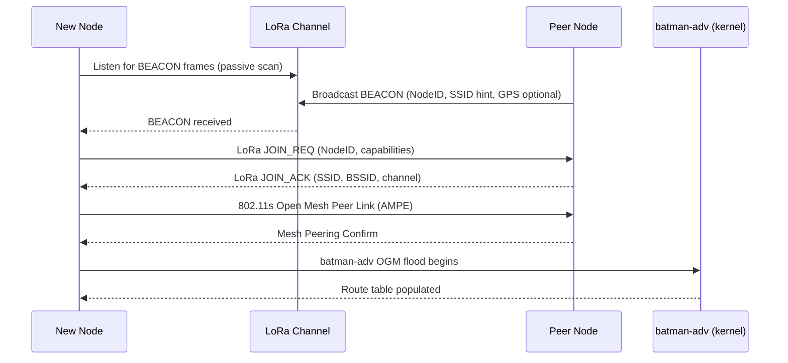

# LoRa-Assisted Mesh Networking Platform — Technical Design Document

> **Status:** Draft v0.2  
> **Date:** 2026-05-12  
> **Repository:** opd-ai/conspiracy  
> **Language:** Go (≥ 1.22)

---

## Table of Contents

1. [Executive Summary](#1-executive-summary)
2. [System Architecture](#2-system-architecture)
3. [LoRa Control Protocol](#3-lora-control-protocol)
4. [Auto-Join Mechanism](#4-auto-join-mechanism)
5. [Go Implementation Plan](#5-go-implementation-plan)
6. [Layer-3 Extensibility](#6-layer-3-extensibility)
7. [Deployment Model](#7-deployment-model)
8. [Risks & Open Questions](#8-risks--open-questions)
9. [License & Compliance Notes](#9-license--compliance-notes)

---

## 1. Executive Summary

This document specifies a **zero-configuration, community-owned layer-2 mesh network** built on IEEE 802.11r/s Wi-Fi and the B.A.T.M.A.N.-adv (`batman-adv`) kernel module, with LoRa (sub-GHz) as a dedicated out-of-band control channel. The platform is implemented in Go, targeting OpenWrt routers and Linux single-board computers equipped with LoRa radio modules via SPI, UART, or USB interfaces (SX127x/SX126x chipsets, USB-Serial LoRa devices).

Any in-range device running the daemon joins the mesh automatically: it listens for LoRa beacons, associates with the strongest peer, and enrolls into the `batman-adv` layer-2 fabric. The LoRa link carries only compact routing hints, neighbor summaries, and device-discovery beacons — never bulk payload — keeping duty-cycle well within regional limits. A clean `HintProvider`/`HintConsumer` interface allows future layer-3 overlays (cjdns, Yggdrasil, or custom protocols) to consume the same hint stream without modifying the core daemon. The design favors existing, permissively-licensed Go libraries, avoids libp2p and web frameworks, and is structured to scale across large geographic deployments with many nodes.

**v0.2 Security and Resilience Enhancements:** This revision addresses critical security and scalability findings from design review, including: 64-bit HMAC authentication, RFC 6479 anti-replay windows, proof-of-work JOIN_REQ rate limiting, encrypted BEACON payloads, bounded peer tables with LRU eviction, global duty-cycle enforcement, OGM rate limiting, goroutine leak prevention, LoRa radio failure recovery, and key rotation protocol design.

---

## 2. System Architecture

### 2.1 Component Overview

```
┌─────────────────────────────────────────────────────────────────────┐
│                          Mesh Node Daemon                           │
│                                                                     │
│  ┌──────────────┐    ┌──────────────┐    ┌──────────────────────┐  │
│  │  LoRa Radio  │    │  Wi-Fi Radio │    │   batman-adv (kernel │  │
│  │  (SX127x/    │    │  (802.11r/s) │    │   module bat0)       │  │
│  │   SX126x)    │    │              │    │                      │  │
│  │  SPI/UART/USB│    │              │    │                      │  │
│  └──────┬───────┘    └──────┬───────┘    └──────────┬───────────┘  │
│         │                   │                       │              │
│  ┌──────▼───────────────────▼───────────────────────▼───────────┐  │
│  │                     Core Daemon (Go)                         │  │
│  │                                                              │  │
│  │  ┌────────────┐  ┌────────────┐  ┌────────────────────────┐ │  │
│  │  │LoRa Driver │  │ nl80211    │  │  batman-adv Controller │ │  │
│  │  │ (loradrv)  │  │ Controller │  │  (batctl / netlink)    │ │  │
│  │  └─────┬──────┘  └─────┬──────┘  └───────────┬────────────┘ │  │
│  │        │               │                     │              │  │
│  │  ┌─────▼───────────────▼─────────────────────▼────────────┐ │  │
│  │  │              Hint Bus (in-process pub/sub)              │ │  │
│  │  └─────────────────────────┬──────────────────────────────┘ │  │
│  │                            │                                │  │
│  │  ┌─────────────────────────▼──────────────────────────────┐ │  │
│  │  │   HintConsumer plugins (cjdns, Yggdrasil, future L3)   │ │  │
│  │  └────────────────────────────────────────────────────────┘ │  │
│  └──────────────────────────────────────────────────────────────┘  │
└─────────────────────────────────────────────────────────────────────┘
```

### 2.2 Mermaid Sequence — Node Join Flow



### 2.3 Data Plane vs. Control Plane Separation

| Dimension | Data Plane | Control Plane |
|---|---|---|
| **Technology** | IEEE 802.11s + batman-adv `bat0` | Raw LoRa (sub-GHz, SX127x/SX126x) |
| **Bandwidth** | Typical 54–300 Mbps (Wi-Fi) | 250 bps – 50 kbps (LoRa SF7–SF12) |
| **Latency** | < 10 ms hop | 100 ms – 2 s per frame |
| **Range** | 50 – 200 m (urban) | 1 – 15 km (open), 0.5 – 3 km (urban) |
| **Payload** | Arbitrary Ethernet frames | ≤ 222 bytes (LoRa practical max) |
| **Role** | User traffic forwarding | Routing hints, beacons, discovery |
| **Protocol** | batman-adv OGM/OGMv2 | Custom hint frames (§3) |
| **Failure mode** | Degrades gracefully | Mesh continues; hints stale |

The LoRa channel is **advisory only**: if it is unavailable, the batman-adv data plane continues to operate using its own OGM protocol. LoRa hints accelerate convergence and assist discovery across range gaps where Wi-Fi cannot reach.

---

## 3. LoRa Control Protocol

### 3.1 Frame Types

| Type ID | Name | Description |
|---------|------|-------------|
| `0x01` | `BEACON` | Periodic node advertisement |
| `0x02` | `JOIN_REQ` | New node requests mesh credentials |
| `0x03` | `JOIN_ACK` | Peer delivers Wi-Fi association parameters |
| `0x04` | `ROUTE_HINT` | Compact neighbor/route summary |
| `0x05` | `REVOKE` | Node departure / route withdrawal |
| `0x06` | `PING` | Liveness check |
| `0x07` | `PONG` | Liveness response |

### 3.2 Common Frame Header (12 bytes)

```
 0                   1                   2                   3
 0 1 2 3 4 5 6 7 8 9 0 1 2 3 4 5 6 7 8 9 0 1 2 3 4 5 6 7 8 9 0 1
+-+-+-+-+-+-+-+-+-+-+-+-+-+-+-+-+-+-+-+-+-+-+-+-+-+-+-+-+-+-+-+-+
| Ver(4)|Rsvd(4)|   Type (8)    |            Seq (16)            |
+-+-+-+-+-+-+-+-+-+-+-+-+-+-+-+-+-+-+-+-+-+-+-+-+-+-+-+-+-+-+-+-+
|                         NodeID (32)                           |
+-+-+-+-+-+-+-+-+-+-+-+-+-+-+-+-+-+-+-+-+-+-+-+-+-+-+-+-+-+-+-+-+
|                        KEY_ID (32)                            |
+-+-+-+-+-+-+-+-+-+-+-+-+-+-+-+-+-+-+-+-+-+-+-+-+-+-+-+-+-+-+-+-+
```

- **Ver** (4 bits): Protocol version; current = `0x1`
- **Rsvd** (4 bits): Reserved, MUST be zero; allows future flag extension without a version bump
- **Type** (8 bits): Frame type from table above
- **Seq** (16 bits): Rolling sequence number for deduplication and anti-replay
- **NodeID** (32 bits): FNV-1a-32 hash of device MAC address (not secret; collision probability acceptable at community scale)
- **KEY_ID** (32 bits): Key identifier = `HMAC-SHA256(MESH_KEY, "key-id")[0:4]`; enables key rotation without breaking compatibility

Total header: 12 bytes, leaving ≥ 210 bytes for payload.

### 3.3 BEACON Frame Payload (encrypted, ≤ 56 bytes typical)

BEACON frames contain sensitive metadata (GPS coordinates, node capabilities, network topology hints) that should not be accessible to non-members. The entire payload is encrypted using ChaCha20-Poly1305 AEAD with a key derived from `MESH_KEY`, preserving open-join (anyone with `MESH_KEY` can decrypt) while preventing reconnaissance attacks.

**Encryption:**
- Algorithm: ChaCha20-Poly1305 (AEAD)
- Key: `HKDF-SHA256(MESH_KEY, salt="beacon-v1", info="encryption", length=32)`
- Nonce: 12 bytes = `NodeID (4) || Seq (2) || Timestamp_ms (6)` (unique per frame)
- Overhead: +16 bytes (Poly1305 authentication tag)

**Plaintext payload structure (before encryption):**

```
+-+-+-+-+-+-+-+-+-+-+-+-+-+-+-+-+-+-+-+-+-+-+-+-+-+-+-+-+-+-+-+-+
| Capabilities (8) |  Channel (8)  | RSSI Avg (8, signed) |Rsvd(8)|
+-+-+-+-+-+-+-+-+-+-+-+-+-+-+-+-+-+-+-+-+-+-+-+-+-+-+-+-+-+-+-+-+
|              SSID Length (8)   |   SSID (≤32 bytes)          |
+-+-+-+-+-+-+-+-+-+-+-+-+-+-+-+-+-+-+-+-+-+-+-+-+-+-+-+-+-+-+-+-+
|  Lat (32-bit fixed-point, 1e-5 deg resolution, optional)      |
+-+-+-+-+-+-+-+-+-+-+-+-+-+-+-+-+-+-+-+-+-+-+-+-+-+-+-+-+-+-+-+-+
|  Lon (32-bit fixed-point, optional)                           |
+-+-+-+-+-+-+-+-+-+-+-+-+-+-+-+-+-+-+-+-+-+-+-+-+-+-+-+-+-+-+-+-+
```

**Encrypted frame structure (on-wire):**

```
+-+-+-+-+-+-+-+-+-+-+-+-+-+-+-+-+-+-+-+-+-+-+-+-+-+-+-+-+-+-+-+-+
|                  Nonce (96 bits / 12 bytes)                   |
|                         (NodeID + Seq + Timestamp)            |
+-+-+-+-+-+-+-+-+-+-+-+-+-+-+-+-+-+-+-+-+-+-+-+-+-+-+-+-+-+-+-+-+
|            Ciphertext (variable, ≤40 bytes typical)           |
|                   (encrypted payload above)                   |
+-+-+-+-+-+-+-+-+-+-+-+-+-+-+-+-+-+-+-+-+-+-+-+-+-+-+-+-+-+-+-+-+
|             Poly1305 Tag (128 bits / 16 bytes)                |
+-+-+-+-+-+-+-+-+-+-+-+-+-+-+-+-+-+-+-+-+-+-+-+-+-+-+-+-+-+-+-+-+
|                  HMAC-SHA256 truncated (64 bits)              |
+-+-+-+-+-+-+-+-+-+-+-+-+-+-+-+-+-+-+-+-+-+-+-+-+-+-+-+-+-+-+-+-+
```

Total encrypted BEACON: 12-byte header + 12-byte nonce + ~40-byte ciphertext + 16-byte tag + 8-byte HMAC = ~88 bytes typical (well within 222-byte LoRa limit).

**Security properties:**
- Confidentiality: Only mesh members with `MESH_KEY` can decrypt
- Authenticity: Poly1305 tag + HMAC-SHA256 provide double authentication
- Privacy: GPS coordinates, SSID, capabilities hidden from non-members
- Replay protection: Nonce includes sequence number (never reused)

**Capabilities byte:**

| Bit | Meaning |
|-----|---------|
| 7 | Has GPS |
| 6 | 802.11r capable |
| 5 | 802.11s capable |
| 4 | batman-adv enrolled |
| 3–0 | Reserved |

### 3.4 ROUTE_HINT Frame Payload (≤ 108 bytes)

Each ROUTE_HINT encodes up to **6 neighbor entries** (≈ 16 bytes each). TTL is strictly limited to prevent amplification attacks.

```
+-+-+-+-+-+-+-+-+-+-+-+-+-+-+-+-+-+-+-+-+-+-+-+-+-+-+-+-+-+-+-+-+
|  Neighbor Count (8)  |  Flags (8)  |  TTL (8)   | Pad (8)   |
+-+-+-+-+-+-+-+-+-+-+-+-+-+-+-+-+-+-+-+-+-+-+-+-+-+-+-+-+-+-+-+-+
| [Neighbor NodeID (32)] [RSSI (8, signed)] [Hops (8)] [Pad16] |
|  ... repeated Neighbor Count times ...                        |
+-+-+-+-+-+-+-+-+-+-+-+-+-+-+-+-+-+-+-+-+-+-+-+-+-+-+-+-+-+-+-+-+
|                HMAC-SHA256 truncated (64 bits)                |
+-+-+-+-+-+-+-+-+-+-+-+-+-+-+-+-+-+-+-+-+-+-+-+-+-+-+-+-+-+-+-+-+
```

**Anti-amplification constraints:**
- `Neighbor Count` MUST be ≤ 6 (reject frames exceeding this)
- `TTL` MUST be ≤ 3 on transmission (enforced at frame generation)
- On receive: if `TTL > 3`, reject frame immediately (drop, log warning)
- On forward: decrement `TTL` before forwarding; drop when `TTL == 0`
- Forwarding rate limit: max 1 forwarded hint per 10 seconds per node (token bucket)
- Deduplication: maintain Bloom filter (1 KB, 0.01% FP rate) of `(NodeID, Seq)` pairs seen in last 60s; don't re-forward duplicates

### 3.5 Duty-Cycle and Collision Avoidance

**Regulatory limits (EU 868 MHz, Sub-Band 1):** 1% duty cycle → maximum 36 seconds on-air per hour at SF12/BW125 (time-on-air ≈ 1 s for 50-byte frame).

| Frame Type | TX Interval | Notes |
|------------|-------------|-------|
| BEACON | 30 – 120 s (jittered ±20%) | Reduces collision probability |
| ROUTE_HINT | On topology change, max 1/60 s | Debounced 5 s |
| JOIN_REQ/ACK | On demand, ≤ 3 retries | Exponential back-off: 1 s, 2 s, 4 s |
| PING/PONG | Only if Wi-Fi link not available | Last-resort |

**Global Duty-Cycle Budget Enforcement:**

To prevent regulatory violations, the daemon implements a centralized duty-cycle manager:

1. **Sliding window tracker**: Maintain 1-hour sliding window of transmitted frames with time-on-air (ToA) calculations
2. **ToA calculation**: Use Semtech formula based on SF, BW, payload length:
   - SF12/BW125/50-byte frame ≈ 1.0s
   - SF10/BW125/50-byte frame ≈ 370ms
   - SF7/BW125/50-byte frame ≈ 60ms
3. **Pre-transmit check**: Before any TX, verify: `sum(ToA, last_hour) + this_ToA ≤ DUTY_CYCLE_LIMIT`
   - Default: `DUTY_CYCLE_LIMIT = 36s` (1% for EU 868 MHz)
   - Configurable per region: US 915 MHz = 4% (144s/hour), AS 433 MHz = 1% (36s/hour)
4. **Priority queue**: If budget exhausted, enqueue with priority:
   - High: JOIN_ACK (ensure joins succeed)
   - Medium: BEACON (network discovery critical)
   - Low: ROUTE_HINT, PING/PONG (advisory, can be deferred)
5. **Backpressure**: Drop low-priority frames if queue exceeds 16 entries
6. **Metrics**: Expose `lora_duty_cycle_used_pct` gauge (alert if >80%)

**Collision avoidance strategy:** Listen-Before-Talk (LBT) with carrier-sense using RSSI threshold (−90 dBm). A node picks a random back-off slot (0–127 ms) before transmitting. Receiving side deduplicates by `(NodeID, Seq)` pairs in a 64-entry LRU cache, TTL 60 s. This is **raw LoRa** (not LoRaWAN Class A), avoiding gateway infrastructure dependency.

### 3.6 Security and Authentication Model

**Threat model:** The LoRa channel is assumed **not confidential** (broadcast, low-power, easily received by anyone in range). The goal is **integrity** (prevent spoofed routing hints that could redirect traffic) and **replay prevention**.

**Mechanism:**

1. **Shared mesh key** (`MESH_KEY`, 256-bit): provisioned out-of-band (QR code, NFC tap, or manual entry). This is the same key used for 802.11s AMPE.

2. **Per-frame HMAC-SHA256, truncated to 64 bits**: `HMAC-SHA256(MESH_KEY, header || payload)[0:8]`. A 64-bit truncated HMAC provides 2^64 (~18 quintillion) possible values, making brute-force attacks computationally infeasible while using only 8 bytes per frame (3.6% of 222-byte LoRa budget). This is a significant security upgrade from 32-bit truncation, which could be brute-forced within hours on modern hardware.

3. **Sequence number with RFC 6479-style anti-replay window** (16-bit rolling): Prevents replay attacks while accommodating out-of-order LoRa packet delivery (20-40% typical loss rate). Each node maintains:
   - **Last accepted sequence** (`last_seq`) per NodeID
   - **128-bit replay bitmap** covering `[last_seq - 127, last_seq]` window
   - Acceptance rules:
     - If `Seq > last_seq`: accept, update `last_seq`, shift bitmap
     - If `Seq` in `[last_seq - 127, last_seq]` and bit clear: accept, set bit
     - If `Seq` in `[last_seq - 127, last_seq]` and bit set: reject (replay)
     - If `Seq < last_seq - 127`: reject (too old)
     - Wrap-around handling: accept `Seq` in `[last_seq + 1, last_seq + 32768]` (forward window)
   - NodeID entries evicted after 10 minutes of inactivity (bounded memory)
   - Bitmap overhead: ~16 bytes per active peer (~1 KB for 64 concurrent peers)

4. **Key rotation support** (v1.1): To enable recovery from key compromise without network rebuild:
   - Each key has 4-byte `KEY_ID = HMAC-SHA256(MESH_KEY, "key-id")[0:4]`
   - BEACON header includes `KEY_ID` field (added to frame format)
   - Key rotation via encrypted LoRa `REKEY` frame: `Encrypt_ChaCha20(OLD_KEY, NEW_KEY || NEW_KEY_ID || VALID_AFTER_TIMESTAMP)`
   - Nodes accept frames authenticated with old or new key during 24-hour transition period
   - After transition, old key expires; compromised devices using old key ejected
   - New nodes provision latest key; key rotation is backward-compatible

5. **No per-node public keys** in v1.0: Adding lightweight ECDH (Curve25519) session layer deferred to v2 as optional extension for deployments requiring per-node authentication.

> **Note:** Sybil attacks cannot be fully prevented with a shared key alone. Rate limiting, proof-of-work, and resource quotas (§4.1, §5.4) provide practical Sybil resistance while preserving open-join. §4.3 discusses the trust model and its limits.

---

## 4. Auto-Join Mechanism

### 4.1 Discovery Sequence

```
New Device                    LoRa Channel              Existing Peer
     │                              │                         │
     │──── LoRa passive listen ────▶│◀──── BEACON (every 30–120s) ────│
     │◀─── BEACON decoded ──────────│                         │
     │                              │                         │
     │─────────────── LoRa JOIN_REQ (NodeID, caps) ──────────▶│
     │◀──────────────── LoRa JOIN_ACK (SSID, BSSID, Ch, NetID) ──│
     │                              │                         │
     │══════════ 802.11s Open Mesh Peering (AMPE) ════════════▶│
     │◀═══════════════ Peering Confirm ═══════════════════════│
     │                              │                         │
     │─── ip link set bat0 up ─────▶[kernel]                  │
     │─── batctl if add mesh0 ─────▶[kernel]                  │
     │◀─── batman-adv OGM flood begins ──────────────────────▶│
     │                              │                         │
     │   [Node is now a full mesh relay]                       │
```

**Step-by-step:**

1. **LoRa scan (0 – 120 s):** New node powers on, tunes LoRa to the configured frequency (default 868.1 MHz EU / 915 MHz US), and listens for `BEACON` frames. If none received within a configurable timeout (`beacon_timeout`, default 120 s), it broadcasts its own `BEACON` (acting as a new mesh seed).

2. **BEACON validation:** Validate HMAC and decrypt payload using `MESH_KEY`. Discard if authentication fails (wrong network or corrupted frame).

3. **JOIN_REQ with Proof-of-Work:** New node sends `JOIN_REQ` to the peer with highest RSSI. To prevent JOIN_REQ floods (F-SEC-002), the request includes proof-of-work:
   - **PoW requirement**: Find `nonce` such that `SHA256(NodeID || nonce || timestamp_ms)[0:2] == 0x0000` (16-bit difficulty)
   - **Cost**: ~65k hash attempts, ~10ms on ARM CPU, ~200µs on x86 (negligible for legitimate joins)
   - **Benefit**: Spamming 1000 JOIN_REQ requires ~10 seconds of CPU, making floods impractical
   - **Validation**: Peer verifies PoW before processing; reject if invalid or timestamp >10s old (prevents precomputation)

4. **JOIN_ACK with Rate Limiting:** Peer enforces per-NodeID quotas before responding:
   - **Token bucket**: 3 JOIN_REQ per hour per NodeID, burst=1
   - **Bounded cache**: Store quota state in LRU map (max 1024 entries, evict oldest on overflow)
   - **Silently drop** requests exceeding quota (no response → attacker gets no amplification)
   - Peer responds with `JOIN_ACK` containing Wi-Fi SSID, BSSID, channel, and **network identifier** (`NetID` = HMAC-SHA256(`MESH_KEY`, `"netid"`)[:4])
   - `MESH_KEY` itself is **never transmitted over LoRa**; `NetID` confirms peer is on same network
   - New node, which already has `MESH_KEY` provisioned out-of-band, verifies `NetID` locally

5. **802.11s peering:** New node configures `wpa_supplicant` (or `hostapd` in mesh mode) with received parameters and initiates `AMPE` (Authenticated Mesh Peering Exchange) using `MESH_KEY` as the PMK seed.

6. **batman-adv enrollment:** Daemon calls `batctl if add <mesh_iface>` via netlink. The kernel module begins flooding OGM packets; routing table converges within seconds.

7. **Relay activation:** By default the node begins relaying immediately. No "admission" step; any node with a valid `MESH_KEY` is trusted (subject to rate limits and resource quotas in §5.4).

### 4.2 IP Address Assignment

No DHCP server is required at the mesh layer (`bat0` is a layer-2 bridge). Upper-layer addressing can be:
- **Link-local IPv6 (SLAAC):** Default; zero configuration.
- **IPv4 APIPA (169.254.x.x):** Fallback for IPv4-only applications.
- **cjdns/Yggdrasil auto-addressing:** Injected by a HintConsumer plugin (§6).

### 4.3 Trust Model and Sybil Considerations

The "no questions asked" join model means **possession of `MESH_KEY` is the sole access credential**. However, v1.0 includes multiple defense layers that provide practical Sybil resistance while preserving open-join:

| Concern | Mitigation |
|---------|-----------|
| Rogue relay (traffic interception) | batman-adv is L2; encryption above L2 (e.g., Yggdrasil) mitigates. |
| Key leakage | Key rotation protocol (§3.6) enables surgical ejection without network rebuild (v1.1). |
| JOIN_REQ flooding | Proof-of-work (16-bit, ~10ms CPU cost) + per-NodeID rate limiting (3/hour) (§4.1). |
| Sybil OGM flooding | Per-originator OGM rate limits (10/sec) + bounded peer table (§5.4). |
| batman-adv table poisoning | Bounded route table (max 10k entries) with LRU eviction (§5.4). |
| LoRa channel DoS | LoRa is advisory; Wi-Fi mesh continues independently. Duty-cycle enforcement (§3.5) prevents regulatory violation. |
| Physical node compromise | Out of scope for v1.0; TPM-backed key storage recommended for sensitive deployments. |

**Defense-in-depth principle:** No single mechanism fully prevents Sybil attacks with a shared key, but layered defenses (computational cost + rate limits + resource quotas) make large-scale attacks impractical while preserving zero-configuration joins for legitimate users.

---

## 5. Go Implementation Plan

### 5.1 Recommended Libraries

```
Library: go.bug.st/serial
License: BSD-3-Clause
Import: go.bug.st/serial
Why: Pure-Go serial abstraction for SX127x/SX126x UART-mode LoRa modules and USB-Serial LoRa devices (e.g., Dragino LG02, RAK811 USB). Actively maintained fork of github.com/tarm/serial with USB CDC-ACM support, no CGo dependency. Supports SPI, UART, and USB interfaces.
```

```
Library: periph.io/x/conn/v3
License: Apache-2.0
Import: periph.io/x/conn/v3/spi
Why: Idiomatic Go hardware abstraction for SPI bus access to SX127x/SX126x in SPI mode (HATs, shields). Cross-platform (Linux, Windows, macOS) with automatic driver selection.
```

```
Library: github.com/brocaar/lorawan
License: MIT
Import: github.com/brocaar/lorawan
Why: LoRaWAN frame encoding primitives reused for compact binary frame marshaling without gateway dependency.
```

```
Library: github.com/vishvananda/netlink
License: Apache-2.0
Import: github.com/vishvananda/netlink
Why: Pure-Go netlink bindings for interface management, route table manipulation, and batman-adv IFLA_INFO_KIND control.
```

```
Library: github.com/mdlayher/netlink
License: MIT
Import: github.com/mdlayher/netlink
Why: Low-level netlink socket abstraction used by nl80211 and batman-adv sub-packages.
```

```
Library: github.com/mdlayher/wifi
License: MIT
Import: github.com/mdlayher/wifi
Why: nl80211-based Wi-Fi control (interface creation, BSS scan, mesh join) without shelling out to iw.
```

```
Library: github.com/pelletier/go-toml/v2
License: MIT
Import: github.com/pelletier/go-toml/v2
Why: TOML config file support; widely used in embedded Go projects; zero external dependencies.
```

```
Library: log/slog (stdlib)
License: BSD-3-Clause (Go stdlib)
Import: log/slog
Why: Structured logging in Go stdlib since 1.21; no additional dependency.
```

```
Library: golang.org/x/crypto
License: BSD-3-Clause
Import: golang.org/x/crypto/hkdf
Why: HKDF key derivation for per-session subkeys from MESH_KEY; well-audited Go extended library.
```

```
Library: github.com/prometheus/client_golang
License: Apache-2.0
Import: github.com/prometheus/client_golang/prometheus
Why: Exposes node metrics (peer count, OGM rate, LoRa RSSI) via net/http handler; no web framework needed.
```

### 5.2 Module and Package Layout

```
conspiracy/
├── cmd/
│   └── conspiracyd/        # daemon entry point
│       └── main.go
├── internal/
│   ├── lora/               # LoRa radio driver and frame codec
│   │   ├── driver.go       # SPI/serial abstraction (periph.io or tarm/serial)
│   │   ├── frame.go        # frame marshal/unmarshal
│   │   └── scheduler.go    # duty-cycle scheduler, LBT, jitter
│   ├── wifi/               # nl80211 / wpa_supplicant control
│   │   ├── mesh.go         # 802.11s mesh join/leave
│   │   └── scan.go         # BSS scan helpers
│   ├── batman/             # batman-adv netlink control
│   │   ├── controller.go   # batctl operations via netlink
│   │   └── ogm.go          # OGM event listener
│   ├── hint/               # HintBus, HintProvider, HintConsumer interfaces
│   │   ├── bus.go          # in-process pub/sub
│   │   └── types.go        # shared types (RoutingHint, Neighbor, etc.)
│   ├── autojoin/           # discovery state machine
│   │   └── join.go
│   ├── crypto/             # HMAC helpers, key management
│   │   └── auth.go
│   └── config/             # config file parsing
│       └── config.go
├── plugins/
│   ├── cjdns/              # HintConsumer for cjdns peering
│   │   └── consumer.go
│   └── yggdrasil/          # HintConsumer for Yggdrasil peering
│       └── consumer.go
├── go.mod
└── go.sum
```

### 5.3 Key Interface Definitions

All network addresses and connections use standard library interfaces.

```go
// internal/lora/driver.go

// PacketRadio is satisfied by any LoRa radio backend.
// It is a deliberate subset of net.PacketConn (omitting LocalAddr) with an
// additional SetDeadline for unified timeout control. Callers can substitute
// a net.UDPConn stub in tests without hardware — note that SetDeadline on a
// UDPConn sets both read and write deadlines simultaneously, which is
// equivalent to calling SetReadDeadline + SetWriteDeadline together.
type PacketRadio interface {
    ReadFrom(p []byte) (n int, addr net.Addr, err error)
    WriteTo(p []byte, addr net.Addr) (n int, err error)
    SetDeadline(t time.Time) error
    SetReadDeadline(t time.Time) error
    SetWriteDeadline(t time.Time) error
    Close() error
}

// LoRaAddr implements net.Addr for a LoRa node identifier.
type LoRaAddr struct{ NodeID uint32 }

func (a LoRaAddr) Network() string { return "lora" }
func (a LoRaAddr) String() string  { return fmt.Sprintf("lora:%08x", a.NodeID) }
```

```go
// internal/hint/types.go

// RoutingHint carries a condensed neighbor summary from the LoRa channel.
type RoutingHint struct {
    Source    net.Addr
    Neighbors []Neighbor
    TTL       uint8
    Timestamp time.Time
}

type Neighbor struct {
    NodeID uint32
    RSSI   int8
    Hops   uint8
}
```

### 5.4 Concurrency Model

The daemon is structured around a set of long-running goroutines communicating via typed channels. To prevent goroutine leaks and ensure bounded resource usage, all concurrency is explicitly limited.

```
┌──────────────────┐      rxQueue          ┌──────────────────┐
│  LoRa RX goroutine│ ─────────────────▶  │  Worker Pool     │
│  (dedicated I/O)  │   (buffered 64)     │  (2×CPU cores)   │───hints──▶ Hint Bus
└──────────────────┘                       └──────────────────┘
                                                               
┌──────────────────┐      hints chan       ┌──────────────────┐
│  batman-adv OGM  │ ─────────────────▶   │   Hint Bus       │
│  listener        │   (buffered 256)     │  (fan-out)       │
└──────────────────┘                       └────────┬─────────┘
                                                    │ (parallel broadcast)
┌──────────────────┐    control chan      ┌────────▼─────────┐
│  Auto-join FSM   │ ◀──────────────────  │ HintConsumer(s)  │
└──────────────────┘                       │ (per-consumer    │
                                           │  buffered chan)  │
                                           └──────────────────┘
```

**Goroutine Management (F-RES-001):**

1. **LoRa RX goroutine** (dedicated, never blocks on processing):
   ```go
   go func() {
       buf := make([]byte, 255) // max LoRa frame size
       for {
           n, addr, err := radio.ReadFrom(buf)
           if err != nil { /* handle error, continue */ }
           select {
           case rxQueue <- Frame{buf[:n], addr, time.Now()}:
               // delivered
           case <-ctx.Done():
               return
           default:
               metricsRxDropped.Inc() // queue full, drop frame
           }
       }
   }()
   ```

2. **Worker pool** (fixed size = 2 × runtime.NumCPU()):
   - Processes frames from `rxQueue` (parse, validate HMAC, decrypt, dispatch)
   - Bounded goroutines prevent OOM under flood
   - Backpressure: if `rxQueue` full (64 entries), LoRa RX drops oldest frames

3. **LoRa TX goroutine** (single writer owns radio):
   - Reads from priority queue `txQueue chan TxRequest` (buffered 16)
   - Enforces duty-cycle budget before transmit (§3.5)
   - Backpressure: if `txQueue` full, drop low-priority frames (PING/PONG)

4. **Watchdog goroutine** (leak detection):
   - Samples `runtime.NumGoroutine()` every 60s
   - Alert if >1000 goroutines (indicates leak)
   - Expose `goroutine_count` gauge metric

**Shared State Protection:**

| State | Protection | Bounded Size | Eviction Policy |
|-------|-----------|--------------|-----------------|
| **Peer table** (`map[uint32]PeerInfo`) | Sharded `sync.RWMutex` (16 shards by `NodeID & 0xF`) | Max 10,000 entries | LRU by last-frame-received timestamp; evict after 24h inactivity |
| **Route table** (batman-adv OGM cache) | `sync.Mutex` | Max 10,000 originators | LRU by last-OGM-received; evict entries with seq# deviation >1000 |
| **OGM rate limiter** | `sync.Map` of token buckets | Bounded by peer table size | Per-originator: 10 OGM/sec, burst=20; drop excess |
| **Anti-replay windows** | `sync.Map` of bitmaps | 128-bit bitmap × active peers (~1 KB for 64 peers) | Evict NodeID entries after 10 min inactivity |
| **JOIN_REQ quotas** | `sync.Map` of token buckets | Max 1024 entries (LRU) | Per-NodeID: 3 req/hour, burst=1; evict oldest on overflow |
| **LoRa TX queue** | `chan TxRequest` (buffered 16) | 16 pending frames | Priority-based: drop LOW before MED before HIGH |
| **LoRa RX queue** | `chan Frame` (buffered 64) | 64 frames (~16 KB) | Drop oldest on overflow (head-drop policy) |
| **LoRa dedup cache** | `sync.Mutex` on LRU map | 512 entries (4 KB) | LRU by frame timestamp; TTL 60s |
| **HintBus consumer channels** | `chan RoutingHint` per consumer | 16 hints per consumer | Drop hint if consumer channel full (non-blocking send) |
| **Config** (read-only after init) | No lock needed | — | Loaded once at start |

**Async RX Pattern (F-PERF-001):** LoRa RX is fully decoupled from frame processing. The radio always returns to ready state within ~1ms, ensuring no frame loss due to processing delays.

**Non-Blocking HintBus (F-RES-002):** Each HintConsumer gets a dedicated buffered channel (cap=16). Bus uses `select` with 100ms timeout when sending; slow consumers cannot block others.

**batman-adv Netlink Optimization:** Route table refreshed every 5 seconds (not per-OGM). Use `NLM_F_DUMP` with incremental updates where supported by `vishvananda/netlink`.

Worker goroutines are started with `context.Context` propagation; shutdown is cooperative via `context.Cancel()`.

### 5.5 LoRa Radio Failure Detection and Recovery (F-RES-004)

LoRa is advisory-only by design, so radio failures should degrade gracefully without crashing the daemon. The system must detect failures, operate without LoRa, and attempt recovery.

**Failure Detection:**

1. **Persistent I/O errors**: Track consecutive failures on `PacketRadio.ReadFrom()` / `WriteTo()`
   - Threshold: 10 consecutive errors within 30 seconds = radio declared failed
   - Error types considered fatal: `ENODEV`, `EIO`, `ECONNRESET` (device disconnected)
   - Transient errors (e.g., `EAGAIN`, `ETIMEDOUT`) do not increment counter

2. **Health check**: If no successful RX/TX in 5 minutes, attempt test transmission
   - Send low-priority PING frame; if TX fails, increment failure counter
   - If radio silent (no frames received) but TX succeeds, radio may be RX-only failed (partial failure)

**Degraded Operation Mode:**

When LoRa radio is declared failed:

1. **Disable LoRa subsystem**:
   - Stop LoRa RX/TX goroutines gracefully (context cancellation)
   - Close `PacketRadio` interface to release hardware
   - Set `lora_operational` boolean metric to `false` (alert ops)

2. **Continue mesh operation**:
   - batman-adv OGM flooding continues independently (802.11s only)
   - JOIN_REQ/BEACON discovery unavailable; nodes must join via existing 802.11s mesh peering
   - HintProviders continue (batman-adv OGM listener still active)
   - HintConsumers receive hints from batman-adv only (no LoRa hints)

3. **User notification**:
   - Log ERROR: "LoRa radio failed after N consecutive errors; continuing in 802.11s-only mode"
   - Expose degraded state via Prometheus metrics and health endpoint

**Automatic Recovery:**

1. **Watchdog timer**: Every 60 seconds, if `lora_operational == false`:
   - Attempt to re-initialize LoRa radio (reopen device, reconfigure registers)
   - If successful: clear failure counter, restart RX/TX goroutines, set `lora_operational = true`
   - If failed: increment recovery attempt counter; exponential backoff (max 10 minutes between attempts)

2. **Recovery success**: Log INFO: "LoRa radio recovered after N attempts"

3. **Permanent failure handling**:
   - After 10 failed recovery attempts, extend retry interval to 10 minutes (don't spam logs)
   - Daemon remains operational indefinitely in degraded mode
   - Manual restart (systemd) required if recovery never succeeds

**Error Handling Principles:**

- **Never panic** on LoRa errors; always return error to caller and log
- **Fail independently**: LoRa failure must not affect 802.11s/batman-adv operation
- **Graceful degradation**: Reduced functionality (no LoRa discovery) beats total failure
- **Automatic recovery**: Transient USB disconnects or SPI bus errors should self-heal without operator intervention

---

## 6. Layer-3 Extensibility

### 6.1 HintProvider and HintConsumer Interfaces

```go
// internal/hint/bus.go

// HintProvider produces RoutingHints from any source (LoRa, batman-adv, etc.)
type HintProvider interface {
    // Subscribe returns a receive-only channel on which the provider sends hints.
    // The provider closes the channel when ctx is cancelled. Callers MUST
    // drain the channel to avoid blocking the provider goroutine; cancel ctx
    // to signal the provider to stop and close the channel.
    Subscribe(ctx context.Context) (<-chan RoutingHint, error)
    Name() string
}

// HintConsumer reacts to RoutingHints to update a layer-3 overlay.
type HintConsumer interface {
    // Consume is called for each hint; implementations MUST be non-blocking
    // or run their own goroutine internally.
    Consume(ctx context.Context, hint RoutingHint) error
    Name() string
}

// Bus fans out hints from all registered providers to all consumers.
// Each consumer gets a dedicated buffered channel to prevent slow consumers
// from blocking others (F-RES-002).
type Bus struct {
    providers       []HintProvider
    consumers       []HintConsumer
    consumerChans   map[string]chan RoutingHint  // keyed by consumer.Name()
    metricsDropped  map[string]prometheus.Counter // per-consumer drop metrics
}

func (b *Bus) Register(p HintProvider) { b.providers = append(b.providers, p) }

func (b *Bus) Attach(c HintConsumer) {
    b.consumers = append(b.consumers, c)
    b.consumerChans[c.Name()] = make(chan RoutingHint, 16) // buffered
}

// Run starts the fan-out loop. Hints from all providers are broadcast to all
// consumers in parallel. If a consumer's channel is full, the hint is dropped
// (non-blocking send with timeout) to prevent one slow consumer from stalling
// the entire bus.
func (b *Bus) Run(ctx context.Context) error {
    // Start consumer goroutines (one per consumer)
    for _, consumer := range b.consumers {
        ch := b.consumerChans[consumer.Name()]
        go func(c HintConsumer, hints <-chan RoutingHint) {
            for {
                select {
                case hint, ok := <-hints:
                    if !ok {
                        return // channel closed, consumer shutdown
                    }
                    if err := c.Consume(ctx, hint); err != nil {
                        log.Warn("consumer failed", "name", c.Name(), "error", err)
                    }
                case <-ctx.Done():
                    return
                }
            }
        }(consumer, ch)
    }
    
    // Fan-out loop: read from all providers, broadcast to all consumers
    for _, provider := range b.providers {
        providerChan, err := provider.Subscribe(ctx)
        if err != nil {
            return fmt.Errorf("provider %s subscribe failed: %w", provider.Name(), err)
        }
        
        go func(name string, hints <-chan RoutingHint) {
            for hint := range hints {
                // Broadcast to all consumers in parallel (non-blocking)
                for consumerName, ch := range b.consumerChans {
                    select {
                    case ch <- hint:
                        // delivered
                    case <-time.After(100 * time.Millisecond):
                        // consumer blocked >100ms, drop hint
                        log.Warn("consumer blocked, dropping hint", 
                            "consumer", consumerName, "provider", name)
                        b.metricsDropped[consumerName].Inc()
                    case <-ctx.Done():
                        return
                    }
                }
            }
        }(provider.Name(), providerChan)
    }
    
    <-ctx.Done()
    // Close all consumer channels on shutdown
    for _, ch := range b.consumerChans {
        close(ch)
    }
    return nil
}
```

### 6.2 Concrete Example — Yggdrasil Peer Injection

Yggdrasil accepts peer addresses via its admin socket (`/var/run/yggdrasil.sock`). When a ROUTE_HINT arrives carrying a neighbor's IPv6 hint (optional extension field), the consumer translates it:

```go
// plugins/yggdrasil/consumer.go

type YggdrasilConsumer struct {
    adminConn net.Conn // unix socket to yggdrasil admin API
}

func (y *YggdrasilConsumer) Consume(ctx context.Context, h hint.RoutingHint) error {
    var errs []error
    for _, n := range h.Neighbors {
        if n.Hops > 2 {
            continue // only inject close neighbors
        }
        addr := deriveYggAddr(n.NodeID) // maps NodeID → Yggdrasil 200::/7 address
        if err := y.addPeer(ctx, addr); err != nil {
            errs = append(errs, err)
        }
    }
    return errors.Join(errs...)
}

func (y *YggdrasilConsumer) Name() string { return "yggdrasil" }
```

### 6.3 Concrete Example — cjdns Peer Injection

cjdns exposes a UDP admin API. The consumer calls `UDPInterface_beginConnection`:

```go
// plugins/cjdns/consumer.go

type CjdnsConsumer struct {
    adminAddr net.Addr // UDP address of cjdns admin interface
    adminConn net.PacketConn
    password  string
}

func (c *CjdnsConsumer) Consume(ctx context.Context, h hint.RoutingHint) error {
    var errs []error
    for _, n := range h.Neighbors {
        pubKey := lookupCjdnsKey(n.NodeID) // from local key registry
        if pubKey == "" {
            continue
        }
        if err := c.beginConnection(ctx, pubKey, n.NodeID); err != nil {
            errs = append(errs, err)
        }
    }
    return errors.Join(errs...)
}

func (c *CjdnsConsumer) Name() string { return "cjdns" }
```

Both consumers register with the `hint.Bus` at startup and receive hints without any changes to the core daemon. A future overlay only needs to implement the two-method `HintConsumer` interface and call `bus.Attach(consumer)`.

---

## 7. Deployment Model

### 7.1 Target Hardware Profiles

| Profile | Example Hardware | Notes |
|---------|-----------------|-------|
| **OpenWrt router** | GL.iNet GL-AR750S + RAK831 LoRa HAT | Most common; OpenWrt provides 802.11s and batman-adv |
| **Linux SBC (ARM)** | Raspberry Pi 4 + RAK2245/SX1302 HAT | High-performance relay node; suitable for gateway role |
| **ARM SBC (minimal)** | NanoPi R2S + LoRa breakout (SX1276) | Low-cost node; single Wi-Fi radio |
| **RISC-V SBC** | Sipeed Lichee Pi 4A | Emerging platform; confirmed Linux 5.15+ batman-adv support |

**Minimum requirements:**
- Linux kernel ≥ 5.10 (batman-adv module, nl80211 generic netlink)
- Go cross-compilation target: `GOARCH=arm64`, `GOARCH=mipsle` (OpenWrt), `GOARCH=riscv64`
- LoRa hardware: SPI bus (e.g., HAT modules), UART (e.g., breakout boards), or USB-Serial (e.g., Dragino LG02, LoRa dongles) with SX127x/SX126x chipsets

### 7.2 System Service

```toml
# /etc/conspiracyd/config.toml (example)
[lora]
device        = "/dev/spidev0.0"   # SPI: /dev/spidev0.0 | UART: /dev/ttyS1 | USB: /dev/ttyUSB0
frequency_mhz = 868.1
spreading     = 10                  # SF10: ~980 bps, ~4 km range
bandwidth_khz = 125
mesh_key      = "hex:aabbcc..."     # 32-byte hex; MUST be changed

[wifi]
mesh_interface = "wlan0"
ssid           = "conspiracy-mesh"
channel        = 6

[batman]
interface      = "bat0"
enabled        = true               # Set to false for 802.11s-only mode (HWMP routing)

[plugins]
yggdrasil = true
cjdns     = false
```

The daemon runs as a systemd unit:

```ini
[Unit]
Description=Conspiracy LoRa-Mesh Daemon
After=network.target

[Service]
ExecStart=/usr/sbin/conspiracyd -config /etc/conspiracyd/config.toml
Restart=on-failure
RestartSec=5s

[Install]
WantedBy=multi-user.target
```

### 7.3 OTA Updates

- **Signed images:** Build artifacts signed with `minisign` (Ed25519). Nodes verify signature before applying.
- **Dual-partition layout:** Standard A/B rootfs flip (OpenWrt sysupgrade compatible).
- **Update channel:** Updates are announced via LoRa `BEACON` extension field carrying a version string and a URL (reachable over the mesh once joined). The actual download happens over the Wi-Fi mesh using `net/http`.
- **Rollback:** Watchdog timer triggers reboot to previous partition if daemon fails to start within 60 s of update.

### 7.4 Bootstrapping a New Network

1. Generate a `MESH_KEY`: `openssl rand -hex 32`
2. Encode as QR code; distribute physically to founding nodes.
3. Flash and configure at least 2 nodes with the same key.
4. Power on — they will find each other via LoRa BEACON within 120 s.
5. Additional nodes join automatically once they have the key provisioned.

---

## 8. Risks & Open Questions

### 8.1 Risks

| Risk | Severity | Likelihood | Mitigation |
|------|----------|-----------|------------|
| Regulatory LoRa duty-cycle violation | High | Medium | Strict TX scheduler with enforcement (§3.5); configurable per-region limits |
| batman-adv route oscillation in dense deployments | Medium | Medium | Tune OGM interval; use batman-adv v2 (B.A.T.M.A.N. V) for more stable metric |
| LoRa collision in high-density deployments (> 50 nodes in range) | Medium | High | Frequency hopping across 3 sub-bands; increase TX jitter window |
| Key management complexity (MESH_KEY distribution) | High | High | QR provisioning, NFC tap; key rotation protocol included (§3.6) |
| batman-adv kernel module unavailable on target | Medium | Low | **Fallback to 802.11s-only mode** (F-RES-003): Daemon probes for batman-adv at startup (`modprobe batman-adv; test -d /sys/module/batman_adv`). If absent: (1) log warning and set `batman_mode=false`, (2) skip batman-adv netlink calls, (3) disable batman-adv OGM listener, (4) continue with 802.11s HWMP routing only, (5) ROUTE_HINT frames still processed for layer-3 HintConsumers (cjdns/Yggdrasil), (6) document limitation: no layer-2 broadcast forwarding across non-adjacent peers. |
| Go cross-compilation gap (CGo dependencies) | Low | Low | Only pure-Go or periph.io libraries selected (§5.1) |
| nl80211 kernel API changes | Low | Low | Depend on `mdlayher/wifi` which tracks upstream nl80211 |

### 8.2 Open Questions

1. **Sub-1 GHz frequency selection:** EU 868 MHz and US 915 MHz are covered; other regions (Asia 433/920 MHz, AU 915–928 MHz) need per-region config profiles.
2. **GPS integration depth:** BEACON optionally carries encrypted lat/lon (§3.3). Should the daemon integrate a GPS daemon (gpsd) for automatic position updates? Consider privacy implications (GDPR/CCPA) and document opt-in requirements.
3. **batman-adv vs. 802.11s mesh routing:** Some deployments may prefer 802.11s path selection (HWMP) without batman-adv. The daemon should support a `batman_adv = false` config option routing only via HWMP (fallback behavior specified in §8.1).
4. **IPv4 addressing:** APIPA (169.254.x.x) is unreliable across large meshes due to collision probability. Consider a deterministic scheme derived from `NodeID`.
5. **Power management:** Battery-powered nodes need adaptive TX interval and CPU sleep. This is not designed for v1.0 but the hint bus architecture accommodates a `PowerManager` consumer.
6. **Multi-radio nodes:** Nodes with 2 Wi-Fi radios can dedicate one to 802.11s mesh and one to client AP. Interface selection logic needs specification.

---

## 9. License & Compliance Notes

All recommended dependencies use OSI-approved permissive licenses. The following table summarizes compliance obligations:

| Library | SPDX License | Obligations |
|---------|-------------|-------------|
| `github.com/tarm/serial` | MIT | Include copyright notice in binary distribution |
| `periph.io/x/periph` | Apache-2.0 | Include `NOTICE` file; patent grant applies |
| `github.com/brocaar/lorawan` | MIT | Include copyright notice |
| `github.com/vishvananda/netlink` | Apache-2.0 | Include `NOTICE` file |
| `github.com/mdlayher/netlink` | MIT | Include copyright notice |
| `github.com/mdlayher/wifi` | MIT | Include copyright notice |
| `github.com/pelletier/go-toml/v2` | MIT | Include copyright notice |
| `log/slog` (Go stdlib) | BSD-3-Clause | Include Go AUTHORS file |
| `golang.org/x/crypto` | BSD-3-Clause | Include Go AUTHORS file |
| `github.com/prometheus/client_golang` | Apache-2.0 | Include `NOTICE` file |

**Project license:** This repository is licensed under the **GNU Affero General Public License v3.0 (AGPL-3.0)** (see `LICENSE`). All recommended dependencies use OSI-approved permissive licenses (MIT, Apache-2.0, BSD-3-Clause), which are compatible with AGPL-3.0 for distribution: permissively-licensed code may be incorporated into an AGPL-3.0 work, but the combined work must be distributed under AGPL-3.0 terms. If a future fork or derivative work requires a permissive-only license (MIT/Apache-2.0), all selected dependencies remain compatible — however this would require relicensing the project itself. For contributions and redistribution, the AGPL-3.0 "network use is distribution" clause applies: any party that runs a modified version as a network service must publish the modified source.

**batman-adv kernel module:** Licensed GPLv2. The daemon communicates with it via netlink sockets (userspace ↔ kernel boundary), which does **not** create a GPL derivative work obligation for the Go daemon itself. This is consistent with the Linux kernel syscall exception.

**OpenWrt integration:** OpenWrt packages are distributed under their respective upstream licenses. The `conspiracy` daemon would be an independent package in the OpenWrt feed, requiring only its own `Makefile` and license file.

**Dependency copyleft analysis:** No GPL/LGPL libraries are linked into the Go binary. All selected libraries are MIT, Apache-2.0, or BSD-3-Clause. The project's AGPL-3.0 license imposes no additional constraints on these dependencies; the obligations flow in one direction (permissive → copyleft is always compatible).

---

*End of document. For questions or contributions, open an issue in the `opd-ai/conspiracy` repository.*
